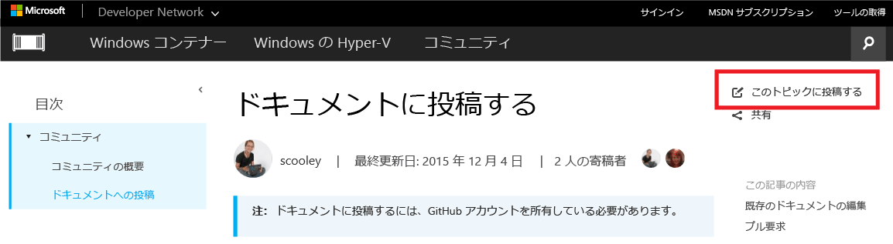
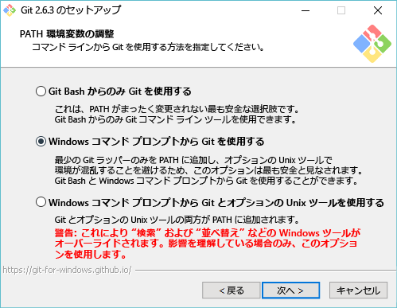

# <a name="contribute-to-the-docs"></a>ドキュメントに投稿する

> **注:** ドキュメントに投稿するには、[GitHub](https://www.github.com) アカウントを所有している必要があります。

## <a name="edit-an-existing-doc"></a>既存のドキュメントの編集

1. 編集するドキュメントを探します。  

2. **[このトピックに投稿する]** を選択します。  
  
  
  すると、そのファイルに関連付けられた GitHub のマークダウン ファイルへと自動的にリダイレクトされます。
  
  GitHub にサインインしていることを確認します。  サインインしていなければ、サインインするか、GitHub アカウントを作成します。
  
  
  
3. 編集アイコンを選択し、ブラウザー内のエディターで編集します。
  
  

4. インラインで変更を加えます。
  
  実行できる操作は次のとおりです。
  1. ファイルの編集
  2. 変更のプレビュー
  3. ファイル名の変更 (この操作が必要になることはまずありません)
  
  
  
5. 変更内容をプル要求として提案します。
  
  

6. 変更内容を確認します。
  
  **プル要求においてマイクロソフトが重視する要素**  
  * 変更内容が正しいこと (テクノロジが正確に表現されていること)
  * スペルや文法が正しいこと
  * ドキュメント内の論理的な場所
    
  

7. [プル要求](contribute-to-docs.md#pull-requests)の作成  

## <a name="pull-requests"></a>プル要求

ほとんどの変更はプル要求を介してコミットされます。  プル要求は、複数のレビューアーで変更セットを審査したり、変更を加えたり、現在のコンテンツについてコメントしたりする手段です。


## <a name="fork-the-repo-and-edit-locally"></a>リポジトリの分岐とローカルでの編集

ドキュメントで長時間作業する場合、リポジトリをローカルにクローンし、自分のコンピューター上で作業することができます。

次に、私 (Sarah Cooley) のセットアップをエミュレートする方法を示します。  同様に正常に動作するセットアップが他にも多数あります。

> **注:** これらすべてのドキュメント ツールは、Linux または OSX でも同様に機能します。  他にガイドが必要な場合には、お問い合わせください。

これは、3 つのセクションに分かれています。
* [Git のセットアップ](contribute-to-docs.md#set-up-git)
  * Git のインストール
  * 最初のセットアップ
  * ドキュメント リポジトリの分岐
  * ローカル マシンへのコピーのクローン
* [資格情報の最初の管理方法](contribute-to-docs.md#validate-and-stash-credentials)
  * 資格情報の格納と資格情報ヘルパーに関する情報。
* [ドキュメントの環境のセットアップ](contribute-to-docs.md#set-up-markdown-editing-environment)
  * VSCode のインストール
  * Git 用の VSCode。便利ないくつかの機能を説明します。
  * 最初のコミットの実行。

### <a name="set-up-git"></a>Git のセットアップ

1. (Windows の場合) Git のインストール ([ここ](https://git-for-windows.github.io/)をクリック)

  インストールで変更する必要のある値は次のみです。

  **PATH 環境を調整する** Windows コマンド プロンプトから Git を使用する

  

  これにより、任意の Windows コンソールの PowerShell コンソールで Git コマンドを使用できます。

2. Git ID の構成

  PowerShell ウィンドウを開き、次を実行します。

  ``` PowerShell
  git config --global user.name "User Name"
  git config --global user.email username@microsoft.com
  ```

  Git では、これらの値をコミットのラベル付けに使用します。

  > 次のエラーが表示される場合、Git は正常にインストールされていないか、PowerShell を再起動する必要があります。
    ``` PowerShell
    git : The term 'git' is not recognized as the name of a cmdlet, function, script file, or operable program. Check the spelling of the name, or if a path was included, verify that the path is correct and try again.
    ```

3. Git 環境の構成

   (このマシンに少なくとも) 一度しかユーザー名とパスワードを入力しなくて済むように、資格情報ヘルパーをセットアップします。
   私はこのベーシックな [Windows 資格情報ヘルパー](https://github.com/Microsoft/Git-Credential-Manager-for-Windows#download-and-install)を使用しています。

   これをインストールしたら、次を実行して資格情報ヘルパーを有効にしてプッシュの動作を設定します。
   ```
   git config --global credential.helper manager
   git config --global push.default simple
   ```

   GitHub に対する最初の認証時には、ユーザー名と、有効にしている場合には 2 要素認証コードを求められます。
   例:
   ```
   C:\Users\plang\Source\Repos\Virtualization-Documentation [master]> git pull
   Please enter your GitHub credentials for https://github.com/
   username: plang@microsoft.com
   password:
   authcode (app): 562689
   ```
   これにより、GitHub 上の正しい資格情報で自動的に[個人用アクセス トークン](https://github.com/settings/tokens)にアクセスし、そのトークンはローカル マシンに安全に格納します。 今後それが求められることはありません。

4. リポジトリの分岐

5. リポジトリのクローン

  Git クローンでは、同じリポジトリの他のクローンと同期するために正しいフックを使用して Git リポジトリをローカルにクローンします。

  既定では、クローンにより現在のディレクトリのリポジトリと同じ名前でフォルダーが作成されます。  私はすべての Git リポジトリを自分のユーザー ディレクトリに保持しています。  Git クローンの詳細については、[こちら](http://git-scm.com/docs/git-clone)をご覧ください。

  ``` PowerShell
  cd ~
  git clone https://github.com/Microsoft/Virtualization-Documentation.git
  ```

  成功すると、`Virtualization-Documentation` フォルダーが作成されます。

  ``` PowerShell
  cd Virtualization-Documentation
  ```

5. [省略可能] Posh-Git のセットアップ

  Posh-Git は、PowerShell で Git を若干使いやすくする、コミュニティで作成された PowerShell モジュールです。  これは、PowerShell の Git にタブ補完を追加し、分岐やファイルの状態の迅速な表示も有益にします。  詳細については、[こちら](https://github.com/dahlbyk/posh-git)をご覧ください。  管理者の PowerShell コンソールで以下を実行すると、Posh-Git をインストールできます。

  ``` PowerShell
  Install-Module -Name posh-git
  ```

  PowerShell を起動するたびに Posh-Git が自動的に動作するように指定するには、次のコードを PowerShell のプロファイルに追加します (例: `%UserProfile%\My Documents\WindowsPowerShell\profile.ps1 `)

  ``` PowerShell
  Import-Module posh-git

  function global:prompt {
    $realLASTEXITCODE = $LASTEXITCODE

    Write-Host($pwd.ProviderPath) -nonewline

    Write-VcsStatus

    $global:LASTEXITCODE = $realLASTEXITCODE
    return "> "
  }
  ```

### <a name="validate-and-stash-credentials"></a>資格情報の検証と格納

  リポジトリが正しくセットアップされたことの検証には、新しいコンテンツの取得を試行します。

  ``` PowerShell
  git pull
  ```


### <a name="set-up-markdown-editing-environment"></a>マークダウン編集環境のセットアップ

1. VSCode のダウンロード

6. テスト コミットの実行。  資格情報が正しく格納されている場合、正しく動作するはずです。


