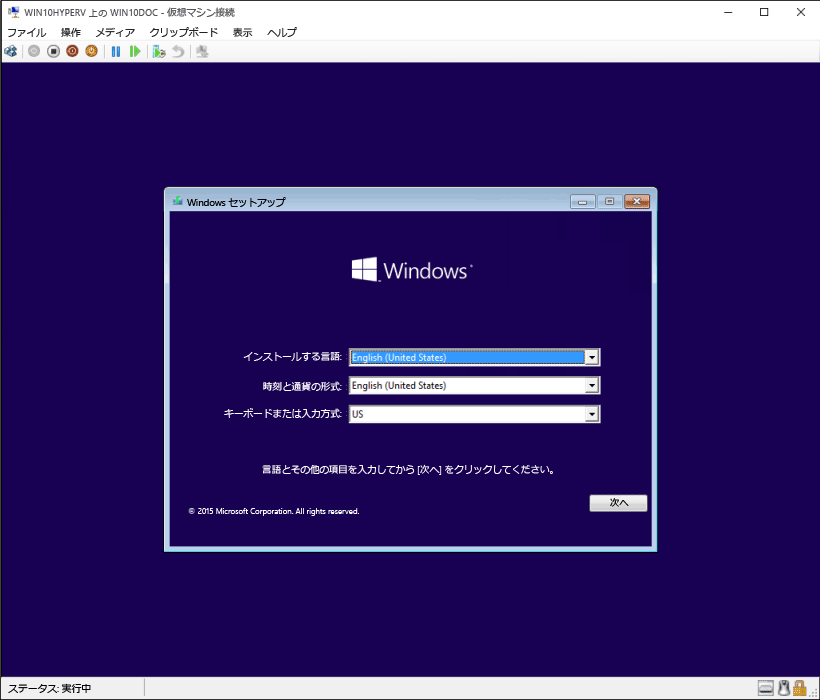

# Hyper-V による仮想マシンの作成

仮想マシンを作成し、オペレーティング システムをインストールします。

以前の3つのリリースで命令が大幅に変更されるように、仮想マシンを作成するための新しいツールを構築しました。

適切な手順については、該当するオペレーティング システムを選択してください。

* [Windows 10 の秋の更新プログラム (v1709) 以降](quick-create-virtual-machine.md#windows-10-fall-creators-update-windows-10-version-1709)
* [Windows 10 の作成者更新プログラム (v1703)](quick-create-virtual-machine.md#windows-10-creators-update-windows-10-version-1703)
* [Windows 10 記念日更新プログラム (v1607) 以前](quick-create-virtual-machine.md#before-windows-10-creators-update-windows-10-version-1607-and-earlier)

それでは始めましょう。

## Windows 10 の秋の更新プログラム (Windows 10 バージョン 1709)

Fall Creators Update ではクイック作成が拡張され、Hyper-V マネージャーから個別に起動できる仮想マシン ギャラリーが追加されています。

Fall Creators Update で新しい仮想マシンを作成するには:

1. スタート メニューから [Hyper-V クイック作成] を開きます。

    

1. オペレーティング システムを選択するか、ローカル インストール ソースを使用して独自のイメージを選択します。

    

    1. 独自のイメージを使用して仮想マシンを作成する場合は、**[ローカル インストール ソース]** を選択します。
    1. **[インストール元の変更]** を選択します。
      
    1. 新しいバーチャル マシンに変換する .iso または .vhdx を選択します。
    1. イメージが Linux イメージの場合は、セキュア ブート オプションを選択解除します。
      

1. [仮想マシンの作成] を選択します。

これで完了です。  残りの操作はクイック作成によって行われます。

## Windows 10 の作成者更新プログラム (Windows 10 バージョン 1703)

1. スタート メニューから [Hyper-V マネージャー] を開きます。

1. Hyper-V マネージャーで、右側の **[操作]** メニューの **[クイック作成]** を選択します。

1. 仮想マシンをカスタマイズします。

    * (オプション) 仮想マシンに名前を付けます。
    * 仮想マシンのインストール メディアを選択します。 .iso ファイルまたは .vhdx ファイルからインストールできます。
    仮想マシンに Windows をインストールする場合は、Windows セキュア ブートを有効にすることができます。 それ以外の場合は、オフのままにします。
    * ネットワークを設定します。
    既存の仮想スイッチがある場合は、ネットワークのドロップダウンで選択できます。 既存のスイッチがない場合は、自動でネットワークを設定するボタンが表示され、これにより仮想ネットワークが自動的に構成されます。

1. **[作成]** をクリックして、仮想マシンの作成を開始します。 設定の編集について心配する必要はありません。いつでも前の手順に戻って設定を変更できます。

    "CD または DVD からブートするには、いずれかのキーを押してください" というメッセージが表示される場合があります。 指示に従って操作してください。  CD からインストールしていることが認識されています。

これで、新しい仮想マシンが作成されました。  オペレーティング システムをインストールする準備が整いました。

仮想マシンは次のように表示されます。

> **注意:** ボリューム ライセンス版の Windows を実行している場合を除き、仮想マシン内で実行する Windows については、別途ライセンスが必要です。 仮想マシンのオペレーティング システムは、ホストのオペレーティング システムから独立しています。

## Windows 10 の作成者向け更新プログラム (Windows 10 バージョン1607以前)

Windows 10 Creators Update 以降を実行していない場合は、仮想マシンの新規作成ウィザードを使用して以下の手順に従います。

1. [仮想ネットワークを作成する](connect-to-network.md)
1. [新しい仮想マシンを作成する](create-virtual-machine.md)
