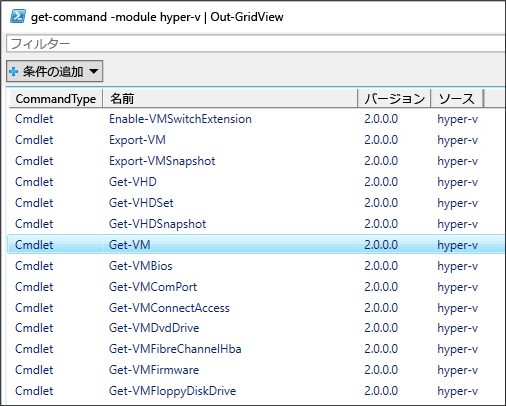
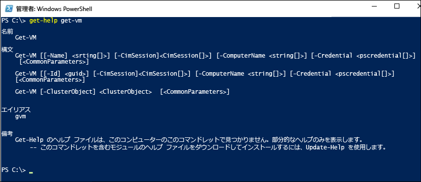

# <a name="working-with-hyper-v-and-windows-powershell"></a>Hyper-V と Windows PowerShell の使用

Hyper-V の展開、仮想マシンの作成、仮想マシンの管理の基本を確認できたので、次は PowerShell でこれらの作業の大半を自動化する方法について説明します。

### <a name="return-a-list-of-hyper-v-commands"></a>HYPER-V のコマンドの一覧を返します

1. Windows の [スタート] ボタンをクリックし、「**PowerShell**」と入力します。
2. 次のコマンドを実行すると、Hyper-V PowerShell モジュールで利用できる PowerShell コマンドの検索可能な一覧が表示されます

 ```powershell
Get-Command -Module hyper-v | Out-GridView
```
  次のような一覧になります。

  

3. 特定の PowerShell コマンドの詳細を確認するには、`Get-Help` を使用します。 たとえば、次のコマンドを実行すると、`Get-VM` Hyper-V コマンドに関する情報が返されます。

  ```powershell
  Get-Help Get-VM
  ```
 コマンドを構築する方法、必須と任意のパラメーター、および使用できるエイリアスが出力されます。

 


### <a name="return-a-list-of-virtual-machines"></a>仮想マシンの一覧を返す

仮想マシンの一覧を返すには、`Get-VM` コマンドを使用します。

1. PowerShell で次のコマンドを実行します。
 
 ```powershell
 Get-VM
 ```
 次のような出力が表示されます。

 

2. 電源がオンになっている仮想マシンのみの一覧を返す場合、`Get-VM` コマンドにフィルターを追加します。 フィルターは `Where-Object` コマンドを使用して追加できます。 フィルター処理の詳細については、[Where-Object の使用](<https://docs.microsoft.com/previous-versions/windows/it-pro/windows-powershell-1.0/ee177028(v=technet.10)>)に関するドキュメントをご覧ください。

 ```powershell
 Get-VM | where {$_.State -eq 'Running'}
 ```
3.  電源のすべての仮想マシンの一覧を表示する、状態を無効には、次のコマンドを実行します。 このコマンドは手順 2. のコマンドのコピーで、フィルターを "Running" から "Off" に変更したものです。

 ```powershell
 Get-VM | where {$_.State -eq 'Off'}
 ```

### <a name="start-and-shut-down-virtual-machines"></a>起動し、仮想マシンをシャットダウン

1. 特定の仮想マシンを起動するには、仮想マシンの名前を指定して次のコマンドを実行します。

 ```powershell
 Start-VM -Name <virtual machine name>
 ```

2. 現在電源がオフになっているすべての仮想マシンを起動するには、そのようなマシンの一覧を取得し、`Start-VM` コマンドに対して一覧を渡します。

  ```powershell
  Get-VM | where {$_.State -eq 'Off'} | Start-VM
  ```
3. 実行中のすべての仮想マシンをシャットダウンするには、次を実行します。
 
  ```powershell
  Get-VM | where {$_.State -eq 'Running'} | Stop-VM
  ```

### <a name="create-a-vm-checkpoint"></a>VM チェックポイントを作成する

PowerShell を使用してチェックポイントを作成するには、`Get-VM` コマンドを使用して仮想マシンを選択し、それを `Checkpoint-VM` コマンドに渡します。 最後に、`-SnapshotName` を使用してチェックポイントに名前を付けます。 完全なコマンドは次のようになります。

 ```powershell
 Get-VM -Name <VM Name> | Checkpoint-VM -SnapshotName <name for snapshot>
 ```
### <a name="create-a-new-virtual-machine"></a>新しい仮想マシンを作成する

次の例は、PowerShell Integrated Scripting Environment (ISE) で新しい仮想マシンを作成する方法を示すものです。 これは単純な例であり、拡張して PowerShell 機能やより高度な VM 展開を追加できます。

1. PowerShell ISE を開くには、[開始] をクリックし、「**PowerShell ISE**」と入力します。
2. 次のコードを実行し、仮想マシンを作成します。 `New-VM` コマンドの詳細については、[New-VM](https://docs.microsoft.com/powershell/module/hyper-v/new-vm?view=win10-ps) ドキュメントを参照してください。

 ```powershell
  $VMName = "VMNAME"

  $VM = @{
      Name = $VMName
      MemoryStartupBytes = 2147483648
      Generation = 2
      NewVHDPath = "C:\Virtual Machines\$VMName\$VMName.vhdx"
      NewVHDSizeBytes = 53687091200
      BootDevice = "VHD"
      Path = "C:\Virtual Machines\$VMName"
      SwitchName = (Get-VMSwitch).Name
  }

  New-VM @VM
 ```

## <a name="wrap-up-and-references"></a>ラップし、参照

このドキュメントでは、Hyper-V PowerShell モジュールについて知るための簡単な手順といくつかのサンプル シナリオを紹介しました。 Hyper-V PowerShell モジュールの詳細については、[Windows PowerShell リファレンスの Hyper-V コマンドレット](https://docs.microsoft.com/powershell/module/hyper-v/index?view=win10-ps)をご覧ください。  
 
