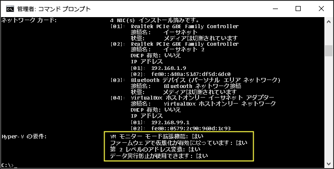

# <a name="windows-10-hyper-v-system-requirements"></a>Windows 10 Hyper-V のシステム要件

Hyper-v は、Windows 10 Pro、Enterprise、および教育の64ビットバージョンで使用できます。 Hyper-V には、第 2 レベルのアドレス変換 (SLAT) 機能が必要です。SLAT とは、Intel と AMD が提供する最新世代の 64 ビット プロセッサに搭載されている機能です。

4 GB の RAM を備えたホストでは基本的な仮想マシンを 3 つまたは 4 つ実行することができますが、仮想マシンが増えれば、より多くのリソースが必要となります。 一方で、物理ハードウェアの内容にもよりますが、32 のプロセッサと 512 GB の RAM を備えた大規模な仮想マシンを作成することもできます。

## <a name="operating-system-requirements"></a>オペレーティング システムの要件

Hyper-V のロールは、次のバージョンの Windows 10 で有効にすることができます。

- Windows 10 Enterprise
- Windows 10 Pro
- Windows 10 Education

Hyper-V のロールは、次のバージョンにはインストール**できません**。

- Windows 10 Home
- Windows 10 Mobile
- Windows 10 Mobile Enterprise

>Windows 10 Home edition は、Windows 10 Pro にアップグレードできます。 アップグレードを行うには、 **[設定]**  >  **[更新とセキュリティ]**  >  **[アクティブ化]** の順に開きます。 ここでストアにアクセスして、アップグレードを購入することができます。

## <a name="hardware-requirements"></a>ハードウェア要件

このドキュメントでは、Hyper-V と互換性のあるハードウェアをすべて一覧していませんが、次のアイテムが必要です。

- 第 2 レベルのアドレス変換 (SLAT) の 64 ビット プロセッサ。
- VM モニター モード拡張機能 (Intel CPU の VT-c) の CPU サポート
- 最小 4 GB のメモリ。 仮想マシンは Hyper-V ホストとメモリを共有するため、予想される仮想ワークロードを処理するために十分なメモリを提供する必要があります。

次の項目をシステム BIOS で有効にする必要があります。
- 仮想化テクノロジ (マザーボードの製造元によってラベルが異なる場合があります)
- ハードウェアによるデータ実行防止

## <a name="verify-hardware-compatibility"></a>ハードウェアの互換性の検証

互換性を検証するには、PowerShell またはコマンド プロンプト (cmd.exe) を開いて、「**systeminfo**」と入力します。 一覧表示された Hyper-V の要件がすべて **Yes** である場合、使用しているシステムで Hyper-V のロールを実行できます。 いずれかの項目が **No** を返す場合、このドキュメントに一覧された要件を確認して、可能な限り調整を行います。



既存の Hyper-V ホストで **systeminfo** を実行すると、Hyper-V の要件セクションでは、次の情報を読み取ります。

```
Hyper-V Requirements: A hypervisor has been detected. Features required for Hyper-V will not be displayed.
```
