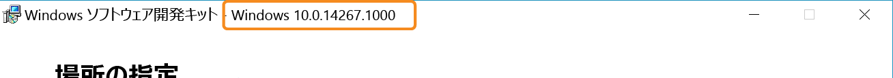

# 独自の統合サービスを作成する

Windows 10 から、Hyper-V ホストとそこで実行されている仮想マシンの間にある新しいソケット ベースの通信チャネルを使用して、インボックスの Hyper-V 統合サービスとよく似たサービスを作成できるようになりました。  この Hyper-V ソケットを使用することで、サービスはネットワーク スタックと関係なく実行でき、すべてのデータが同じ物理メモリ上に格納されます。

このドキュメントでは、Hyper-V ソケット上に構築された簡単なアプリケーションの作成とそれらの使用を開始する方法の手順について説明します。

[PowerShell Direct](../user_guide/vmsession.md) は Hyper-V ソケットを使用して通信するアプリケーション (この例では、インボックス Windows サービス) の例です。

**サポートされているホスト OS**
* Windows 10 ビルド 14290 以降
* Windows Server Technical Preview 4 以降
* 今後のリリース (サーバー 2016年 +)

**サポートされているゲスト OS**
* Windows 10
* Windows Server Technical Preview 4 以降
* 今後のリリース (サーバー 2016年 +)
* Linux ゲストと Linux 統合サービス (「[Supported Linux and FreeBSD virtual machines for Hyper-V on Windows (Windows 上の Hyper-V 向けにサポートされる Linux と FreeBSD 仮想マシン)](https://technet.microsoft.com/library/dn531030(ws.12).aspx)」をご覧ください)

**機能と制限事項**  
* カーネル モードまたはユーザー モード操作をサポート  
* データ ストリームのみ      
* ブロック メモリなし (バックアップ/ビデオに最適でない)   

--------------

## はじめに
現在、Hyper-V ソケットは、ネイティブ コード (C++) で使用できます。  

簡単なアプリケーションを作成するには、次が必要です。
* C コンパイラ。  お持ちではない場合は、[Visual Studio コミュニティ](https://aka.ms/vs)を確認してください。
* Hyper-V と仮想マシンを実行しているコンピューター。  
  * ホストおよびゲスト (VM) OS は、Windows 10、Windows Server Technical Preview 3 以降である必要があります。
* Hyper-V ホストにインストールされた [Windows 10 SDK](http://aka.ms/flightingSDK)

**Windows SDK の詳細**

Windows SDK へのリンク:
* [Windows 10 SDK for Insider Preview](http://aka.ms/flightingSDK)
* [Windows 10 SDK](https://dev.windows.com/en-us/downloads/windows-10-sdk)

Hyper-V ソケット用 API が Windows 10 ビルド 14290 でご利用いただけるようになりました。フライティング ダウンロードは、最新の Insider Fast Track フライティング ビルドと一致します。  
奇妙な動作をする場合、[TechNet フォーラム](https://social.technet.microsoft.com/Forums/windowsserver/en-US/home "TechNet Forums")でお知らせください。  投稿に、以下を含めてください。
* 予期しない動作 
* ホスト、ゲスト、SDK の OS とビルド番号。  
  
  SDK ビルド番号は、SDK インストーラーのタイトルに表示されます。  
  


## 新しいアプリケーションの登録
Hyper-V ソケットを使用するには、アプリケーションを Hyper-V ホストのレジストリに登録する必要があります。

レジストリにサービスを登録することで、次が得られます。
*  使用可能なサービスを有効化、無効化、および一覧表示するための WMI 管理
*  仮想マシンと直接通信するアクセス許可

次の PowerShell は、"HV Socket Demo" という名前の新しいアプリケーションを登録しています。  これは管理者として実行する必要があります。  手動の手順は次のとおりです。

``` PowerShell
$friendlyName = "HV Socket Demo"

# Create a new random GUID and add it to the services list then add the name as a value

$service = New-Item -Path "HKLM:\SOFTWARE\Microsoft\Windows NT\CurrentVersion\Virtualization\GuestCommunicationServices" -Name ((New-Guid).Guid)

$service.SetValue("ElementName", $friendlyName)

# Copy GUID to clipboard for later use
$service.PSChildName | clip.exe
```

** レジストリの場所と情報 **  

``` 
HKEY_LOCAL_MACHINE\SOFTWARE\Microsoft\Windows NT\CurrentVersion\Virtualization\GuestCommunicationServices\
```  
このレジストリの場所には、いくつかの GUID が表示されます。  これらは、マイクロソフトのボックスでのサービスです。

サービスごとのレジストリ内の情報。
* `Service GUID`   
    * `ElementName (REG_SZ)` - これは、サービスのフレンドリ名です。

独自のサービスを登録するには、独自の GUID とフレンドリ名を使用して新しいレジストリ キーを作成します。

フレンドリ名は、新しいアプリケーションに関連付けられます。  これは、GUID が適切でないパフォーマンス カウンターやその他の場所に表示されます。

レジストリ エントリは、次のようになります。
```
HKEY_LOCAL_MACHINE\SOFTWARE\Microsoft\Windows NT\CurrentVersion\Virtualization\GuestCommunicationServices\
    999E53D4-3D5C-4C3E-8779-BED06EC056E1\
        ElementName REG_SZ  VM Session Service
    YourGUID\
        ElementName REG_SZ  Your Service Friendly Name
```

> ** ヒント:** PowerShell で GUID を生成し、それをクリップボードにコピーするには、次を実行します。  
``` PowerShell
(New-Guid).Guid | clip.exe
```

## Hyper-V ソケットの作成

最も基本的な例で、ソケットの定義には、アドレス ファミリ、接続の種類、およびプロトコルが必要です。

次に、簡単な[ソケット定義](
https://msdn.microsoft.com/en-us/library/windows/desktop/ms740506(v=vs.85).aspx
)を示します。

``` C
SOCKET WSAAPI socket(
  _In_ int af,
  _In_ int type,
  _In_ int protocol
);
``` 

Hyper-V ソケットの場合:
* アドレス ファミリ - `AF_HYPERV`
* 種類 - `SOCK_STREAM`
* プロトコル - `HV_PROTOCOL_RAW`


これは宣言/インスタンスの例です。  
``` C
SOCKET sock = socket(AF_HYPERV, SOCK_STREAM, HV_PROTOCOL_RAW);
```


## Hyper-V ソケットへのバインド

バインドは、ソケットと接続情報を関連付けます。

便宜上、下に関数定義をコピーしていますが、バインドの詳細については[こちら](https://msdn.microsoft.com/en-us/library/windows/desktop/ms737550.aspx)をご覧ください。

``` C
int bind(
  _In_ SOCKET                s,
  _In_ const struct sockaddr *name,
  _In_ int                   namelen
);
```

ホスト マシンの IP アドレスとそのホスト上のポート番号から構成される標準インターネット プロトコル アドレス ファミリ (`AF_INET`) のソケット アドレス (sockaddr) と対照的に、`AF_HYPERV` のソケット アドレスでは、仮想マシンの ID と上に定義したアプリケーション ID を使用して、接続を確立します。 

Hyper-V ソケットは、ネットワーク スタック、TCP/IP、DNS などに依存しないため、ソケット エンドポイントには、引き続きあいまいに接続を記述する、ホスト名ではない非 IP 形式が必要です。

Hyper-V ソケットのソケット アドレスの定義を次に示します。

``` C
struct SOCKADDR_HV
{
     ADDRESS_FAMILY Family;
     USHORT Reserved;
     GUID VmId;
     GUID ServiceId;
};
```

IP またはホスト名の代わりに、AF_HYPERV エンドポイントは 2 つの GUID に大きく依存します。  
* VM ID – これは、VM あたりに割り当てられた一意の ID です。  次の PowerShell サンプルを使用して、VM の ID を確認できます。  
  ```PowerShell
  (Get-VM -Name $VMName).Id
  ```
* サービス ID - アプリケーションを Hyper-V ホスト レジストリに登録するための[上記の](#RegisterANewApplication) GUID。

接続が特定の仮想マシンとの接続でない場合は、一連の VMID ワイルドカードを使用することもできます。
 
### VMID ワイルドカード

| 名前 | GUID | 説明 |
|:-----|:-----|:-----|
| HV_GUID_ZERO | 00000000-0000-0000-0000-000000000000 | リスナーは、すべてのパーティションからの接続を受け入れるために、この VmId にバインドする必要があります。 |
| HV_GUID_WILDCARD | 00000000-0000-0000-0000-000000000000 | リスナーは、すべてのパーティションからの接続を受け入れるために、この VmId にバインドする必要があります。 |
| HV_GUID_BROADCAST | FFFFFFFF-FFFF-FFFF-FFFF-FFFFFFFFFFFF | |  
| HV_GUID_CHILDREN | 90db8b89-0d35-4f79-8ce9-49ea0ac8b7cd | 子のワイルドカード アドレス。 リスナーは、その子からの接続を受け入れるために、この VmId にバインドする必要があります。 |
| HV_GUID_LOOPBACK | e0e16197-dd56-4a10-9195-5ee7a155a838 | ループバック アドレス。 この VmId を使用して、コネクタと同じパーティションに接続します。 |
| HV_GUID_PARENT | a42e7cda-d03f-480c-9cc2-a4de20abb878 | 親アドレス。 この VmId を使用して、コネクタの親パーティションに接続します。* |


***HV_GUID_PARENT**  
仮想マシンの親は、そのホストです。  コンテナーの親は、コンテナーのホストです。  
仮想マシンで実行しているコンテナーからの接続は、コンテナーをホストしている仮想マシンに接続します。  
この VmId でリッスンし、次からの接続を受け入れます。  
(コンテナー内): コンテナー ホスト。  
(VM 内: コンテナー ホスト/コンテナーなし): VM ホスト。  
(VM 内でない: コンテナー ホスト/コンテナーなし): サポートされていません。

## サポートされているソケット コマンド

Socket()  
Bind()  
Connect()  
Send()  
Listen()  
Accept()  

[完全な WinSock API](https://msdn.microsoft.com/en-us/library/windows/desktop/ms741394.aspx)

## 進行中の作業
正常な切断の選択


<!--HONumber=Jun16_HO5-->


