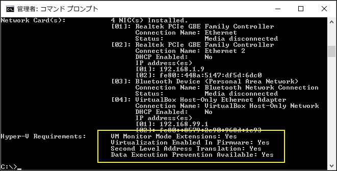

# Windows 10 Hyper-V のシステム要件

Windows 10 の Hyper-V は、特定のハードウェアとオペレーティング システムの構成のみで動作します。 このドキュメントでは、Hyper-V のソフトウェアとハードウェアの要件について簡単に説明し、使用しているシステムの Hyper-V との互換性をチェックする方法を示します。 このドキュメントでは、Hyper-V と互換性のあるすべてのシステム構成は詳しく説明されていませんが、このガイダンスを使用すると、現在のシステムが Hyper-V 仮想マシンをホストできるかどうかをすばやく把握することができます。

## オペレーティング システムの要件

Hyper-V のロールは、次のバージョンの Windows 10 で有効にすることができます。

- Windows 10 Enterprise
- Windows 10 Professional
- Windows 10 Education

Hyper-V のロールは、次のバージョンにはインストールできません。

- Windows 10 Home
- Windows 10 Mobile
- Windows 10 Mobile Enterprise

> Windows 10 Home Edition は、Windows 10 Professional にアップグレードすることができます。 アップグレードを行うには、**[設定]**、**[更新とセキュリティ]**、**[アクティブ化]** の順に開きます。 ここでストアにアクセスして、アップグレードを購入することができます。

## ハードウェア要件

このドキュメントでは、Hyper-V と互換性のあるハードウェアの完全な一覧は提供されませんが、次の項目が必要です。

- 第 2 レベルのアドレス変換 (SLAT) の 64 ビット プロセッサ
- VM モニター モード拡張機能 (Intel CPU の VT-c) の CPU サポート
- 最小 4 GB のメモリ。ただし、仮想マシンは Hyper-V ホストとメモリを共有するため、予想される仮想ワークロードを処理するために十分なメモリを提供する必要があります

次の項目をシステム BIOS で有効にする必要があります。
- 仮想化テクノロジ (マザーボードの製造元によってラベルが異なる場合があります)
- ハードウェアによるデータ実行防止

## ハードウェアの互換性の検証

互換性を検証するには、PowerShell またはコマンド プロンプト (cmd.exe) を開いて、「**systeminfo.exe**」と入力します。 これで Hyper-V の互換性に関する情報が返されます。
一覧された Hyper-V の要件がすべて **Yes** である場合、使用しているシステムで Hyper-V の役割を実行できます。 いずれかの項目が **No** を返す場合、このドキュメントに一覧された要件を確認して、可能な限り調整を行います。



既存の Hyper-V ホストで **systeminfo.exe** を実行すると、Hyper-V の要件セクションでは、次の情報を読み取ります。

```
Hyper-V Requirements: A hypervisor has been detected. Features required for Hyper-V are not be displayed.
```

## 次のステップ - Hyper-V のインストール

[次のステップ - Hyper-V のインストール](walkthrough_install.md)


