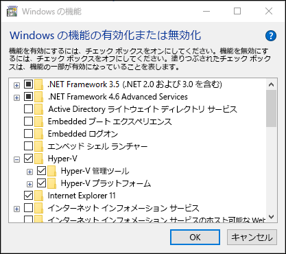
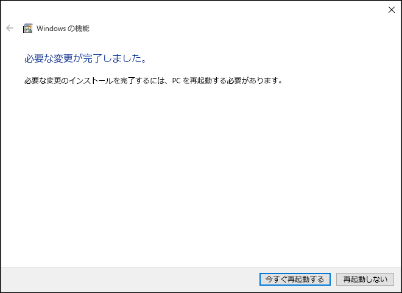
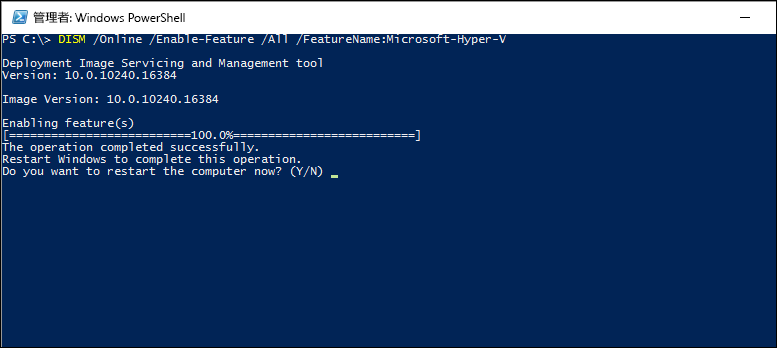

# Windows 10 上に Hyper-V をインストールする

Windows 10 上に仮想マシンを作成する前に、Hyper-V の役割を有効にする必要があります。 Windows 10 のコントロール パネル、PowerShell、または展開イメージのサービスと管理 (DISM) ツールを使用して、有効にすることができます。 このドキュメントでは、この手順について説明します。

> Hyper-V を有効にする前に、システムの互換性を確認します。 詳細については、「[Windows 10 Hyper-V のシステム要件](https://msdn.microsoft.com/virtualization/hyperv_on_windows/quick_start/walkthrough_compatibility)」を参照してください。

## 手動で Hyper-V のロールをインストールする

1. [Windows] ボタンを右クリックし、[プログラムと機能] を選択します。

2. **[Windows の機能の有効化または無効化]** を選択します。

3. **[Hyper-V]** を選択して、**[OK]** をクリックします。



インストールが完了すると、コンピューターを再起動するメッセージが表示されます。



## PowerShell での Hyper-V のインストール

1. 管理者として PowerShell コンソールを開きます。

2. 次のコマンドを実行します。

```powershell
Enable-WindowsOptionalFeature -Online -FeatureName Microsoft-Hyper-V –All
```
インストールが完了すると、コンピューターを再起動する必要があります。

## DISM での Hyper-V のインストール

展開イメージのサービスと管理 (DISM) ツールは、Windows イメージのサービスおよび Windows プレインストール環境の準備に使用されます。 また、DISM では、オペレーティング システムの実行中に、Windows の機能を有効にすることもできます。 詳細については、「[DISM テクニカル リファレンス](https://technet.microsoft.com/en-us/library/hh824821.aspx)」を参照してください。

DISM を使用して Hyper-V のロールを有効にするには

1. 管理者として PowerShell または CMD セッションを開始します。

2. 次のコマンドを入力します。

```powershell
DISM /Online /Enable-Feature /All /FeatureName:Microsoft-Hyper-V
```



## 次のステップ - 仮想スイッチの作成

[仮想スイッチを作成する](walkthrough_virtual_switch.md)


