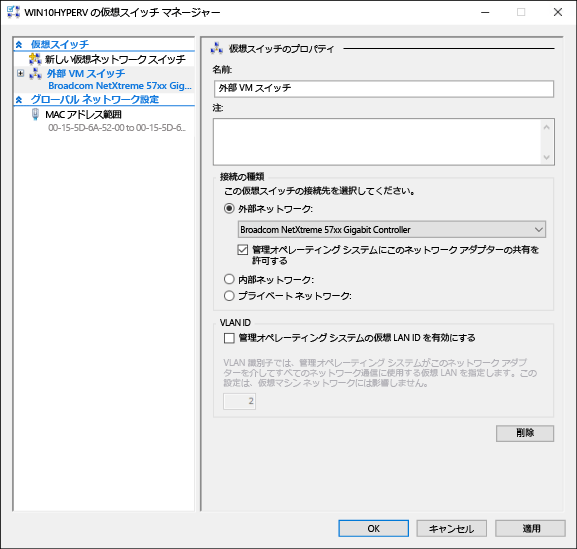
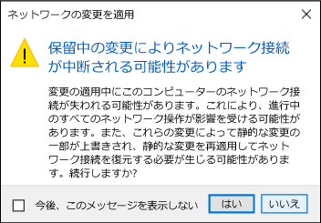

# 仮想スイッチを作成する

Hyper-V で仮想マシンを作成する前に、物理的ネットワークに接続する方法をその仮想マシンに提供する必要があります。 Hyper-V には、仮想マシン ネットワーク カードを仮想スイッチに接続し、ネットワーク接続を可能にするソフトウェア ベースのネットワーク技術が含まれています。 Hyper-V で作成した仮想スイッチはそれぞれ、次の 3 つの接続方法のうちのいずれかで構成できます。

- **外部ネットワーク** – 仮想スイッチは物理ネットワーク アダプターに接続されます。そのアダプターが物理ネットワーク、Hyper-V ホスト、仮想マシンの間の接続を提供します。 この構成では、物理的に接続されたネットワーク カードで通信するホスト機能の有効/無効を切り替えることもできます。 VM のトラフィックだけを特定の物理ネットワーク カードに分離する場合に便利です。

- **内部ネットワーク** – 仮想スイッチは物理ネットワーク アダプターに接続されません。ただし、仮想マシンと Hyper-V ホストの間にはネットワーク接続が存在します。

- **プライベート ネットワーク** – 仮想スイッチは物理ネットワーク アダプターに接続されません。仮想マシンと Hyper-V ホストの間にはネットワーク接続が存在しません。

## 仮想スイッチを手動で作成する

この演習では、Hyper-V マネージャーを利用して外部仮想スイッチを作成する方法を段階的に進めます。 完了すると、Hyper-V ホストに仮想マシンが追加され、それを利用して仮想マシンを物理ネットワークに接続できます。

1. Hyper-V マネージャーを開きます。

2. Hyper-V ホストの名前を右クリックし、**[仮想スイッチ マネージャー]** を選択します。

3. [仮想スイッチ] の下で **[新しい仮想ネットワーク スイッチ]** を選択します。

4. [仮想スイッチの作成] で、**[外部]** をクリックします。

5. **[仮想スイッチの作成]** ボタンを選択します。

6. [仮想スイッチのプロパティ] の下で「**External VM Switch**」のような名前を新しいスイッチに付けます。

7. [接続の種類] で、**[外部ネットワーク]** が選択されていることを確認します。

8. 新しい仮想スイッチとペアになる物理ネットワーク カードを選択します。これがネットワークに物理的に接続されるネットワーク カードです。

    

9. **[適用]** を選択し、仮想スイッチを作成します。 通常はこの時点で次のようなメッセージが表示されます。**[はい]** をクリックして続行します。

    

10. **[OK]** を選択し、仮想スイッチ マネージャーのウィンドウを閉じます。

## PowerShell で仮想スイッチを作成する

次の手順は、PowerShell を使用して仮想スイッチと外部接続を作成する際に使用されます。

1. **Get-NetAdapter** を使用し、Windows 10 システムに接続されているネットワーク アダプターの一覧を取得します。

    ```powershell
    PS C:\> Get-NetAdapter
    
    Name                      InterfaceDescription                    ifIndex Status       MacAddress             LinkSpeed
    ----                      --------------------                    ------- ------       ----------             ---------
    Ethernet 2                Broadcom NetXtreme 57xx Gigabit Cont...       5 Up           BC-30-5B-A8-C1-7F         1 Gbps
    Ethernet                  Intel(R) PRO/100 M Desktop Adapter            3 Up           00-0E-0C-A8-DC-31        10 Mbps  
    ```

2. Hyper-V スイッチで使用するネットワーク アダプターを選択し、**$net** という名前の変数にインスタンスを指定します。

    ```
    $net = Get-NetAdapter -Name 'Ethernet'
    ```

3. 次のコマンドを実行し、新しい Hyper-V 仮想スイッチを作成します。

    ```
    New-VMSwitch -Name "External VM Switch" -AllowManagementOS $True -NetAdapterName $net.Name
    ```

## 仮想スイッチとラップトップ

ラップトップで Windows 10 Hyper-V を実行している場合、イーサネットと無線ネットワーク カードの両方の仮想スイッチを作成すると便利です。 そのような構成では、ラップトップの接続方法に基づいて、スイッチ間で仮想マシンを変更できます。 仮想マシンが有線と無線を自動で切り替えることはありません。

## 次の手順 - 仮想マシンを作成する

[Windows 仮想マシンを作成する](walkthrough_create_vm.md)


