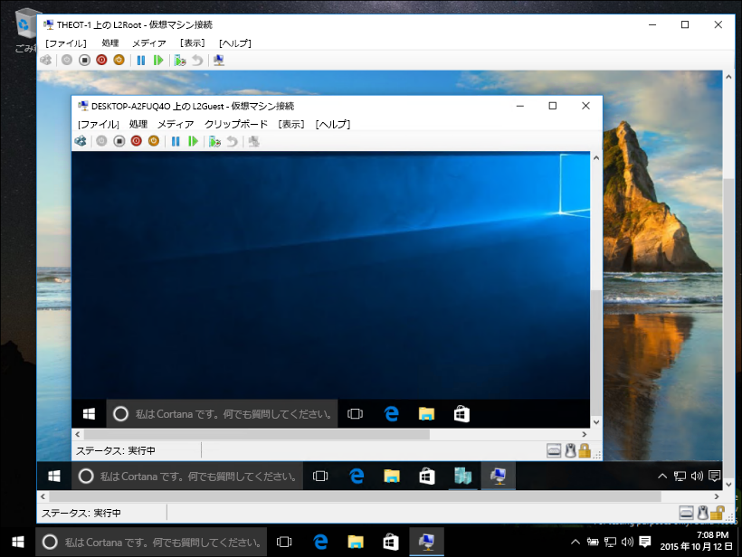
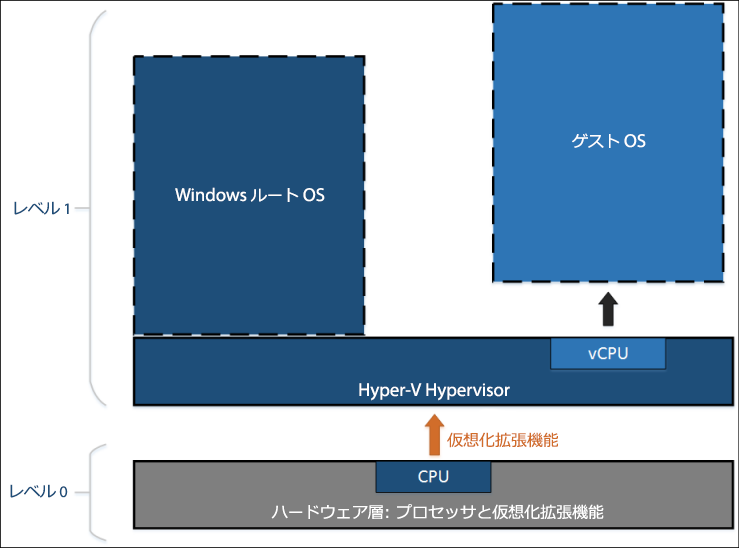
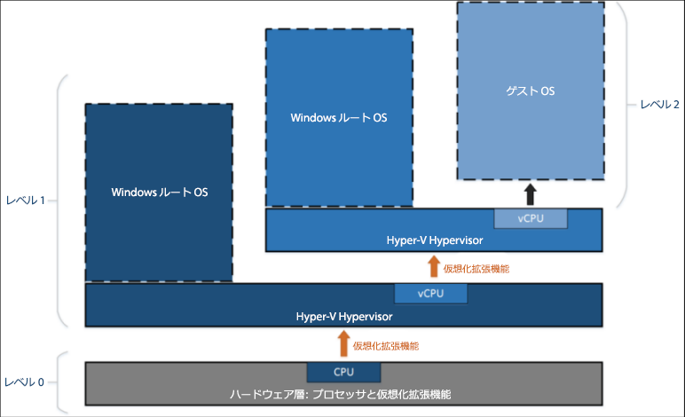

# 入れ子になった仮想化

> **注:** この初期プレビュー機能は、ビルド 10565 以降の Windows Insider でのみ使用でき、パフォーマンスや安定性は保証されていません。

入れ子になった仮想化は、仮想化された環境内で仮想化を実行するものです。 つまり、入れ子では、仮想マシン内で Hyper-V サーバー ロールを実行できます。



Hyper-V は、ハードウェア仮想化サポート (Intel VT-x や AMD-V など) に依存して仮想マシンを実行します。 通常、Hyper-V がインストールされると、ハイパーバイザーはゲスト仮想マシンからこの機能を非表示にします。 これにより、ゲスト仮想マシンが他のハイパーバイザー間で Hyper-V サーバー ロールを実行することを防止できます。

入れ子になった仮想化は、これらのハードウェア仮想化サポート コンポーネントをゲスト仮想マシンに公開します。

次の図は、入れ子になっていない Hyper-V を示しています。 Hyper-V ハイパーバイザーは、ハードウェア仮想化拡張機能 (オレンジ色の矢印) を完全に制御し、ゲスト オペレーティング システムには公開しません。



これに対し、次の図は、入れ子になっている Hyper-V を示しています。 この場合、Hyper-V は、ハードウェア仮想化拡張機能をその仮想マシンに公開します。 入れ子が有効になると、ゲスト仮想マシンは独自のハイパーバイザーをインストールし、独自のゲスト VM を実行します。



## 入れ子になった仮想化の要件

入れ子になった仮想化を有効にする前に、これがプレビューであることを理解しておいてください。 運用環境では入れ子を使用しないでください。

要件:
* 最低 4 GB の RAM が使用可能である必要があります。 入れ子になった仮想化には、十分な量のメモリが必要です。
* 両方のハイパーバイザーが、最新の Windows Insider のビルド (10565 以降) である必要があります。 それ以外のハイパーバイザーは機能しません。
* 現在のところ、この機能は Intel 専用です。 Intel VT-x が必要となります。

## 入れ子になった仮想化の有効化

1. ホストと同じビルドを実行する仮想マシンを作成します。[こちらを参照](../quick_start/walkthrough_create_vm.md)してください。

2. Hyper-V ホスト上の管理者として[このスクリプト](https://github.com/Microsoft/Virtualization-Documentation/blob/master/hyperv-tools/Nested/Enable-NestedVm.ps1)を実行します。

    この初期プレビューでは、入れ子にいくつかの構成要件が付属しています。 [この PowerShell スクリプト](https://github.com/Microsoft/Virtualization-Documentation/blob/master/hyperv-tools/Nested/Enable-NestedVm.ps1)は、処理を簡単にするために、構成を確認して不適切な内容を変更し、指定された仮想マシンに対して、入れ子になった仮想化を有効にします。

  ``` PowerShell
  Invoke-WebRequest https://raw.githubusercontent.com/Microsoft/Virtualization-Documentation/master/hyperv-tools/Nested/Enable-NestedVm.ps1 -OutFile ~/Enable-NestedVm.ps1 
  ~/Enable-NestedVm.ps1 -VmName "DemoVM"
  ```

3. 仮想マシンに Hyper-V をインストールします。

  ``` PowerShell
  Invoke-Command -VMName "DemoVM" -ScriptBlock { Enable-WindowsOptionalFeature -FeatureName Microsoft-Hyper-V -Online; Restart-Computer }
  ```

4. 入れ子になった仮想マシンを作成します。

## 既知の問題

既知の問題の一覧を次に示します。
* Device Guard が有効になっているホストは、仮想化拡張機能をゲストに公開できません。

* Virtualization Based Security (VBS) が有効になっているホストは、仮想化拡張機能をゲストに公開できません。 入れ子になった仮想化をプレビューするには、まず VBS を無効にする必要があります。

* 仮想マシンで入れ子になった仮想化を有効にすると、次の機能とその VM との互換性がなくなります。  
    仮想マシンが他の仮想マシンをホストしている場合は、これらの操作が失敗するか、またはその仮想マシンが起動しません。
    * 動的メモリをオフにする必要があります。 これにより、VM が起動しなくなります。
    * ランタイム メモリのサイズ変更が失敗します。
    * 実行中の VM にチェックポイントを適用する操作が失敗します。
    * ライブ移行が失敗します。つまり、他の VM をホストする VM をライブ移行できません。
    * 保存/復元が失敗します。

    > **注:** これらの機能は、"最も内側" のゲスト VM では動作します。 これらの制限は、最初のレイヤーの VM のみに適用されます

* 入れ子になった仮想化を有効にした後、ネットワーキングが「最も内側」のゲストで動作するには、仮想マシンで MAC スプーフィングを有効にする必要があります。

## よく寄せられる質問とトラブルシューティング

### 仮想マシンが起動しませんが、どうすればよいですか。

1. 動的メモリがオフになっていることを確認してください。
2. 管理者特権でのプロンプトから、ホスト コンピューターでこの PowerShell スクリプトを実行します。

    このスクリプトは、ホストと VM が入れ子用に正しく構成されているかどうかをレポートします。

  ``` PowerShell
  Invoke-WebRequest https://raw.githubusercontent.com/Microsoft/Virtualization-Documentation/master/hyperv-tools/Nested/Get-NestedVirtStatus.ps1 -OutFile ~/Get-NestedVirtStatus.ps1 
  ~/Get-NestedVirtStatus.ps1
  ```

### 仮想マシン接続が繰り返し切断されます。

パスワードを空白にしている場合、これは既知の問題です。 パスワードを変更すると、問題が解決されます。

### 該当の問題がここにはありません。

該当の問題が見つからない場合や フィードバックがある場合は、 ご連絡ください。

Windows フィードバック アプリ、[仮想化フォーラム](https://social.technet.microsoft.com/Forums/windowsserver/En-us/home?forum=winserverhyperv)、または [GitHub](https://github.com/Microsoft/Virtualization-Documentation) を使用して報告してください。


