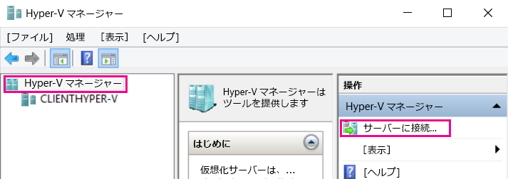
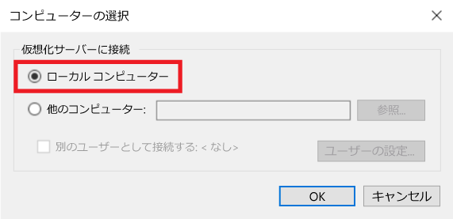
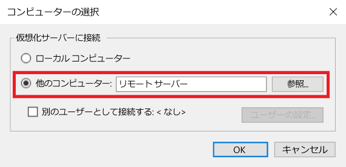
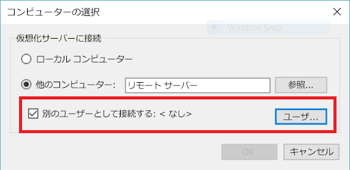

# Hyper-V マネージャーを使用したリモート Hyper-V ホストの管理

Hyper-V マネージャーは、ローカル Hyper-V ホストおよび少数のリモート ホストを診断および管理するためのインボックス ツールです。  この記事では、サポートされているすべての構成で、Hyper-V マネージャーを使用して Hyper-V ホストに接続するための構成手順について説明します。

> Hyper-V マネージャーは、[Hyper-V が含まれているすべての Windows OS](../quick_start/walkthrough_compatibility.md#OperatingSystemRequirements) 上で、**[プログラムと機能]** にある **[Hyper-V 管理ツール]** として使用できます。  リモート ホストを管理するために、Hyper-V プラットフォームを有効にする必要はありません。

Hyper-V マネージャーで Hyper-V ホストに接続するには、左側のウィンドウで **[Hyper-V マネージャー]** が選択されていることを確認してから、右側のウィンドウで **[サーバーへの接続]** を選択します。



## サポートされている Hyper-V ホストと Hyper-V マネージャーとの組み合わせ
Windows 10 の Hyper-V マネージャーでは、次の Hyper-V ホストを管理できます。
* Windows 10
* Windows 8.1
* Windows 8
* Windows Server 2016 - すべてのエディションとインストール オプション (Nano Server を含む)、および対応するバージョンの Hyper-V Server
* Windows Server 2012 R2 - すべてのエディションとインストール オプション、および対応するバージョンの Hyper-V Server
* Windows Server 2012 - すべてのエディションとインストール オプション、および対応するバージョンの Hyper-V Server

Windows 8.1 および Windows Server 2012 R2 の Hyper-V マネージャーで管理できるものは次のとおりです。
* Windows 8.1
* Windows 8
* Windows Server 2012 R2 - すべてのエディションとインストール オプション、および対応するバージョンの Hyper-V Server
* Windows Server 2012 - すべてのエディションとインストール オプション、および対応するバージョンの Hyper-V Server

Windows 8 および Windows Server 2012 の Hyper-V マネージャーで管理できるものは次のとおりです。
* Windows 8
* Windows Server 2012 - すべてのエディションとインストール オプション、および対応するバージョンの Hyper-V Server

Windows 7 および Windows Server 2008 R2 の Hyper-V マネージャーで管理できるものは次のとおりです。
* Windows Server 2008 R2 - すべてのエディションとインストール オプション、および対応するバージョンの Hyper-V Server

Windows Vista および Windows Server 2008 の Hyper-V マネージャーで管理できるものは次のとおりです。
* Windows Server 2008 - すべてのエディションとインストール オプション、および対応するバージョンの Hyper-V Server

> **注:** Hyper-V マネージャーの機能は、管理しているバージョンで使用できる機能と一致します。 つまり、リモートの Windows Server 2012 ホストを Windows Server 2012 R2 から管理する場合に、Windows Server 2012 R2 の Hyper-V マネージャーにある新しい機能を使用することはできません。

## ローカル ホストの管理 ##
ローカル ホストを Hyper-V ホストとして Hyper-V マネージャーに追加するには、**[コンピューターの選択]** ダイアログ ボックスで **[ローカル コンピューター]** を選択します。



接続を確立できない場合は、次の手順に従います。
*  Hyper-V プラットフォーム ロールが有効になっていることを確認します。  
  Hyper-V がサポートされているかどうかを確認するには、[互換性を確認するためのチュートリアル セクション](../quick_start/walkthrough_compatibility.md)をご覧ください。
*  ユーザー アカウントが Hyper-V 管理者グループに含まれることを確認します。


## 同じドメイン内の別の Hyper-V ホストの管理 ##

リモート Hyper-V ホストを Hyper-V マネージャーに追加するには、**[コンピューターの選択]** ダイアログ ボックスで **[別のコンピューター]** を選択し、テキスト フィールドにリモート ホストのホスト名 NetBIOS または FQDN を入力します。



リモート Hyper-V ホストを管理するには、ローカル コンピューターとリモート ホストの両方でリモート管理を有効にする必要があります。

この操作を行うには、`System Properties -> Remote Management Settings` を選択するか、管理者として次の PowerShell コマンドを実行します。  

``` PowerShell
Enable-PSRemoting
```

現在のユーザー アカウントがリモート ホスト上の Hyper-V 管理者アカウントと一致する場合は、**[OK]** をクリックして接続します。  

> これは、Windows 8 または Windows 8.1 の Hyper-V マネージャーでリモート ホストを管理するためにサポートされている唯一の方法です。


Windows 10 では、リモート接続の種類の有効な組み合わせが大幅に拡張されています。  
ホスト名または IP アドレスを使用して、リモート Windows 10 以降のホストに接続できるようになりました。  Hyper-V マネージャーでは、代替ユーザー資格情報もサポートされるようになりました。  


### 別のユーザーとしてリモート ホストに接続する
> このことができるのは、Windows 10 または Windows Server 2016 Technical Preview 3 以降のリモート ホストに接続する場合のみです。

Windows 10 では、リモート ホスト用の正しいユーザー アカウントで実行していない場合、代替資格情報で別のユーザーとして接続できます。

リモート Hyper-V ホストの資格情報を指定するには、**[コンピューターの選択]** ダイアログ ボックスで **[別のユーザーとして接続する]** を選択し、**[ユーザーの設定]** を選択します。




### IP アドレスを使用してリモート ホストに接続する
> このことができるのは、Windows 10 または Windows Server 2016 Technical Preview 3 以降のリモート ホストに接続する場合のみです。

場合によっては、ホスト名よりも IP アドレスを使って接続するほうが簡単です。Windows 10 ではこれだけが可能です。

IP アドレスを使用して接続するには、**[別のコンピューター]** テキスト フィールドに IP アドレスを入力します。


## ドメインの外部 (またはドメインなし) で Hyper-V ホストを管理する ##
> このことができるのは、Windows 10 または Windows Server 2016 Technical Preview 3 以降のリモート ホストに接続する場合のみです。

管理対象の Hyper-V ホストで、管理者として次を実行します。

1.  [Enable-PSRemoting](https://technet.microsoft.com/en-us/library/hh849694.aspx)
  * [Enable-PSRemoting](https://technet.microsoft.com/en-us/library/hh849694.aspx) は、*プライベート* ネットワーク ゾーンに必要なファイアウォール規則を作成します。 パブリック ゾーンでこのアクセスを許可するには、CredSSP および WinRM のルールを有効にする必要があります。
2.  [Enable-WSManCredSSP](https://technet.microsoft.com/en-us/library/hh849872.aspx) -Role server

管理している PC で、次のコマンドを管理者として実行します。

1. Set-Item WSMan:\localhost\Client\TrustedHosts -value "fqdn-of-hyper-v-host"
  * 代わりに、管理用にすべてのホストを信頼することを許可できます。
  * Set-Item WSMan:\localhost\Client\TrustedHosts -value * -force
2. [Enable-WSManCredSSP](https://technet.microsoft.com/en-us/library/hh849872.aspx) -Role client -DelegateComputer "fqdn-of-hyper-v-host"
  * 代わりに、管理用にすべてのホストを信頼することを許可できます。
  * [Enable-WSManCredSSP](https://technet.microsoft.com/en-us/library/hh849872.aspx) -Role client -DelegateComputer *
3. 加えて、次のグループ ポリシーの構成が必要になる可能性があります: ** コンピューターの構成 | 管理用テンプレート | システム | 資格情報の委任 | NTLM のみのサーバー認証で新しい資格情報の委任を許可する **
    * **[有効]** をクリックし、*wsman/fqdn-of-hyper-v-host* を追加します。
    * 代わりに、_wsman/*_ を追加して、管理用にすべてのホストを信頼することを許可できます。


<!--HONumber=Sep16_HO3-->


