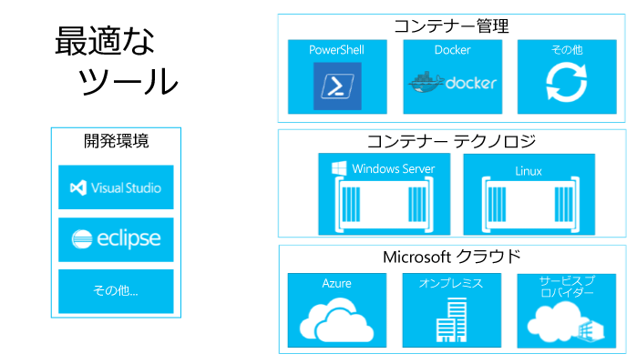

# コンテナーエコシステムの構築について

コンテナーエコシステムの構築が非常に重要である理由を理解するために、まずそのコンポーネントについて説明します。

## コンテナーエコシステムのコンポーネント

Windows コンテナーは、大規模なコンテナーエコシステムの重要なコンポーネントです。 ソリューション スタックの各層で開発者に選択肢を提供するため、業界全体で取り組んでいます。

コンテナーエコシステムは、コンテナーで実行されるアプリを管理、共有、開発する方法を提供します。

マイクロソフトでは、開発者がこうした次世代アプリケーションを構築する際の選択肢と生産性を提供することで、開発者を支援します。 私たちの目標は、開発者の生産性を高めることです。これは、アプリケーションがコードを変更、書き換え、または再構成することなく、任意の Microsoft クラウドを対象とすることを意味します。

Microsoft は、オープンでエコシステムに対応しています。 イノベーションを促進するために、Windows や Linux などの複数の開発者エコシステムの組み合わせが積極的にサポートされています。

今後数か月の間に、この開発用エコシステムの追加パートナーに関する詳細情報を提供します。