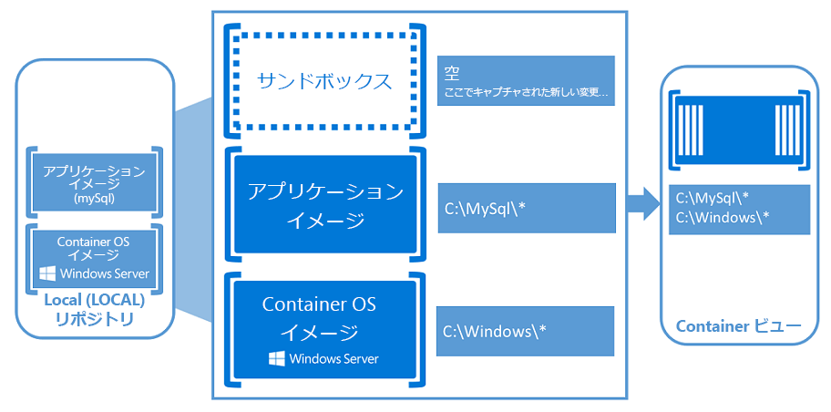

# Windows コンテナー

## コンテナーとは

コンテナーとは、分離された独自のボックスにアプリケーションをラップする方法です。 コンテナー内のアプリケーションは、ボックスの外に存在するアプリケーションやプロセスを認識しません。 コンテナー内には、アプリケーションの正常な実行に必要なすべての要素も存在します。  ボックスを移動しても、アプリケーションの実行に必要な要素がすべて揃っているため、アプリケーションが常に正常に実行されます。

これは、すべてが揃ったキッチンのようなものです。 すべての電化製品や家具、鍋やフライパン、食器用洗剤、ハンドタオルがすべてパッケージ化されたキッチン。 これがコンテナーです。

このコンテナーは移動して、どのようなアパートの部屋 (ホスト) にでも組み込むことができ、移動先で同じキッチンとして機能します。 必要な電化製品がすべて揃っているため、電気と水を接続すれば、すぐに料理を始められます。

これとほとんど同じ意味で、コンテナーはこのキッチンに似ています。 このキッチンは、異なる部屋に組み込まれることもあれば、多くの同じ部屋に組み込まれることもあります。 重要なのは、コンテナーには必要なすべての要素がパッケージ化されて付属している点です。

簡単な概要を見る: [Windows ベースのコンテナー: エンタープライズ レベルの制御を使用した最新のアプリ開発](https://youtu.be/Ryx3o0rD5lY)。

## コンテナーの基礎

コンテナーは、分離されリソース制御された、移植可能なランタイム環境であり、ホスト マシンまたは仮想マシン上で実行されます。 コンテナー内で実行されるアプリケーションまたはプロセスは、必要なすべての必要な依存関係および構成ファイルと共にパッケージ化されており、コンテナーの外部で他のプロセスが一切実行されていないかのように動作します。

コンテナーのホストがコンテナーのリソースのセットをプロビジョニングし、コンテナーはこれらのリソースのみを使用します。 コンテナーの認識では、与えられた以外のリソースは存在しないため、近隣のコンテナー用にプロビジョニングされたリソースがあっても使用できません。

Windows コンテナーの作成と使用を開始する際には、次の主要な概念が役立ちます。

**コンテナー ホスト:** Windows コンテナー機能を使用して構成された物理または仮想のコンピューター システム。 コンテナー ホストは、1 つ以上の Windows コンテナーを実行します。

**コンテナー イメージ:** ソフトウェアのインストールなどによってコンテナー ファイル システムまたはレジストリに変更が加えられると、それらの変更がサンドボックスでキャプチャされます。 これらの変更を継承する新しいコンテナーを作成できるように、この状態をキャプチャする場合がよくあります。 それがイメージです。いったんコンテナーが停止したら、そのサンドボックスを破棄するか、サンドボックスを新しいコンテナー イメージに変換することができます。 たとえば、Windows Server Core OS イメージからコンテナーを展開したとします。 次に、MySQL をこのコンテナーにインストールします。 このコンテナーから新しいイメージを作成すると、コンテナーの展開可能なバージョンとして機能します。 このイメージには、加えられた変更 (MySQL) のみが含まれますが、コンテナーの OS イメージの最上位レイヤーとして機能します。

**サンドボックス:** コンテナーが起動すると、ファイル システムの変更、レジストリの変更、ソフトウェアのインストールなどのすべての書き込みアクションは、この "サンドボックス" レイヤーでキャプチャされます。

**コンテナーの OS イメージ:** コンテナーは、イメージから展開されます。 コンテナーの OS イメージとは、コンテナーを構成する潜在的に多くのイメージ レイヤーの最初のレイヤーです。 このイメージがオペレーティング システム環境を提供します。 コンテナー OS イメージは不変です。 つまり、これを変更することはできません。

**コンテナー リポジトリ:** コンテナー イメージが作成されるたびに、コンテナー イメージとその依存関係がローカル リポジトリに格納されます。 これらのイメージは、コンテナー ホストで何度も再利用できます。 コンテナー イメージは、多くの異なるコンテナー ホスト間で使用できるように、DockerHub などのパブリック レジストリまたはプライベート レジストリにも格納できます。

仮想マシンに詳しい場合、コンテナーは仮想マシンとほとんど同じように使用できます。 コンテナーは、オペレーティング システムを実行し、ファイル システムを保有しています。物理または仮想コンピューター システムと同様に、ネットワーク経由でアクセスできます。 ただし、コンテナーの背後にあるテクノロジと概念は、仮想マシンのものとは大きく異なります。

それらの違いについては、Microsoft Azure の専門家である Mark Russinovich が[優れたブログ記事](https://azure.microsoft.com/en-us/blog/containers-docker-windows-and-trends/)を公開しています。

## Windows コンテナーの種類

Windows コンテナーには、2 つの異なるタイプのコンテナー (ランタイム) が含まれます。

**Windows Server コンテナー** – プロセスと名前空間の分離テクノロジを使用してアプリケーションを分離します。 Windows Server コンテナーでは、コンテナー ホストおよびそのホスト上で実行されているすべてのコンテナーとの間でカーネルを共有します。 これらのコンテナーは、敵対的なセキュリティ境界を提供しないため、信頼されていないコードを分離するために使用しないでください。 これらのコンテナーはカーネルを共有しているため、カーネルのバージョンと構成を同一にする必要があります。

**Hyper-V による分離**: 高度に最適化した仮想マシン上で各コンテナーが実行されるため、Windows Server コンテナーの分離性が向上します。 この構成では、コンテナー ホストのカーネルは、同じホスト上の他のコンテナーと共有されません。 これらのコンテナーは、仮想マシンと同じセキュリティが保証されているため、敵対的なマルチテナント ホスティングに適しています。 これらのコンテナーは、ホストやホスト上の他のコンテナーとカーネルを共有しないため、異なるバージョンや構成 (サポートされている範囲内で) のカーネルを実行できます。たとえば、Windows 10 上のすべての Windows コンテナーで Hyper-V による分離を使用して、Windows Server のカーネル バージョンと構成を使用することができます。

Windows でコンテナーの実行に Hyper-V の分離を使用するかどうかは、実行時に決定されます。 最初に Hyper-V の分離を使用してコンテナーを作成し、後から実行時に、Windows Server コンテナーとして実行するように変更することもできます。

## Docker とは

コンテナーについての資料で、必ず言及されるのが Docker です。 Docker は、コンテナーのイメージをパッケージ化して配信するための容器です。 この自動プロセスによってイメージ (実際にはテンプレート) が生成され、生成されたイメージはどこでも (オンプレミス、クラウド内、または個人のコンピューター上のいずれでも) コンテナーとして実行できます。

Windows Server コンテナーは、他のコンテナーと同様、[Docker](https://www.docker.com) によって管理できます。

## 開発者向けのコンテナー ##

開発者のデスクトップからテスト マシン、実稼働コンピューター群に至るまで、環境全体にまったく同じように展開される Docker イメージを瞬時に作成できます。 これにより、Docker コンテナーにパッケージ化された、大規模に拡大するエコシステムが作成されています。このエコシステムには、DockerHub と、Docker が保持するパブリック コンテナー化されたアプリケーション レジストリがあり、パブリック コミュニティ リポジトリには、現在、180,000 以上のアプリケーションが公開されています。

アプリケーションをコンテナー化する際に、アプリケーションとそれを実行するのに必要なコンポーネントだけが「イメージ」に結合されます。 その後、必要に応じて、このイメージからコンテナーが作成されます。 イメージを別のイメージを作成するためのベースラインとして使用して、イメージの作成をさらに高速化することもできます。 複数のコンテナーが同じイメージを共有できます。これはコンテナーが非常に短時間で起動でき、リソースの使用量を減らせることを意味します。 たとえば、コンテナーを使用して、分散アプリケーション用の軽量のポータブル アプリケーション コンポーネント (「マイクロサービス」) を起動して、迅速に各サービスを個別に拡張することができます。

コンテナーは、アプリケーションを実行するために必要なすべてのものがあり、移植性が非常に高く、Windows Server 2016 を実行している任意のマシンで実行できます。 コンテナーを作成してローカルでテストし、その同じコンテナー イメージを会社のプライベート クラウド、パブリック クラウドまたはサービス プロバイダーに展開することができます。 コンテナーに備わっている機敏性が、大規模で仮想化されたクラウド環境におけるアプリケーション開発パターンをサポートします。

コンテナーを使用すると、開発者は、任意の言語でアプリケーションを作成できます。 これらのアプリケーションは完全に移植可能で、コード変更をすることなく、ラップトップ、デスクトップ、サーバー、プライベート クラウド、パブリック クラウド、サービス プロバイダーといった任意の場所で実行できます。  

コンテナーを使用すると、開発者は、より品質の高いアプリケーションをより短時間で作成し出荷することができます。

## IT プロフェッショナル向けのコンテナー ##

IT プロフェッショナルは、コンテナーを使用して、開発、品質保証、運用の各チームに標準化された環境を提供することができます。 これにより、複雑なインストールと構成手順について心配する必要がなくなります。 コンテナーを使用して、システム管理者は、OS のインストールと基礎となるインフラストラクチャとの差を取り除きます。

コンテナーは、管理者が更新と管理が簡単なインフラストラクチャを作成することに役立ちます。

## コンテナー オーケストレーター
コンテナーは、サイズが小さく、アプリケーション向けであるため、アジャイル配信環境やマイクロサービス ベースのアーキテクチャに最適です。 ただし、コンテナーとマイクロサービスを使用すると、環境内のコンポーネントは容易に数百個から数千個に達します。  数十台の仮想マシンや物理サーバーは手動で管理することができますが、オートメーションを使用せず、実稼働規模のコンテナー環境を管理する方法はありません。  多数のコンテナーおよびコンテナー間のやり取りを自動化して管理するタスクは、オーケストレーションと呼ばれます。 

標準的なオーケストレーションの定義には、次のタスクが含まれています。

- スケジュール設定: 特定のコンテナー イメージとリソース要求について、コンテナーを実行するのに適切なマシンを見つけます。
アフィニティ/アンチ アフィニティ: 一連のコンテナーを互いに近くで実行するか (パフォーマンス重視) か、十分に距離を置いて実行するか (可用性重視) を指定します。
- 正常性の監視: コンテナー エラーを監視し、自動的にスケジュールを再調整します。
- フェールオーバー: 各マシンで何が実行されているかを追跡し、障害が発生したマシンから正常なノードにコンテナーのスケジュールを再調整します。
- 規模の調整: 需要に応じて、コンテナー インスタンスを手動または自動で追加または削除します。
- ネットワーク: 複数のホスト コンピューター間で通信するためにコンテナーの調整用のオーバーレイ ネットワークを提供します。
- サービスの検出: コンテナーがホスト コンピューター間で移動され、IP アドレスが変更された場合でも、自動的に互いを見つけることができるようにします。
- アプリケーション アップグレード調整: アプリケーションのダウンタイムを回避し、問題が発生した場合はロールバックできるように、コンテナーのアップグレードを管理します。

Azure には、Azure Container Service (AKS) と Service Fabric の 2 つのコンテナー オーケストレーターが用意されています。

[Azure Container Service (AKS)](/azure/aks/) を使用すると、コンテナー化アプリケーションを実行するように事前に構成された仮想マシンのクラスターを、簡単に作成、構成、管理できます。 これにより、既存のスキルを使用して、つまり、発展し続ける膨大なコミュニティの専門知識を活用して、Microsoft Azure でコンテナー ベースのアプリケーションを展開および管理できます。 AKS を使用することで、Kubernetes と Docker イメージ形式を通じてアプリケーションの移植性を維持しつつ、Azure のエンタープライズ レベルの機能を利用できます。

[Azure Service Fabric](/azure/service-fabric/) は、スケーラブルで信頼性の高いマイクロサービスとコンテナーを容易にパッケージ化、展開、管理できる分散システム プラットフォームです。 Service Fabric によって、クラウド ネイティブ アプリケーションを開発、管理する際の重要な問題を解決します。 開発者や管理者は、複雑なインフラストラクチャの問題を回避し、ミッション クリティカルで要求の厳しいワークロードを、スケーラブルで、信頼性が高く、管理しやすい方法で実装することに集中できます。 Service Fabric は、このようなエンタープライズ クラス、階層 1、クラウド規模のアプリケーションを構築および管理するための次世代プラットフォームです。

## 概要に関するビデオ

<iframe src="https://channel9.msdn.com/Blogs/containers/Containers-101-with-Microsoft-and-Docker/player" width="800" height="450" allowFullScreen="true" frameBorder="0" scrolling="no"></iframe>

## Windows Server コンテナーを使ってみる

コンテナーの優れた機能を試してみるには、 以下のリンクをクリックして、最初のコンテナーを実際に展開してみましょう。  
Windows Server をお使いの場合は、[Windows Server クイック スタートの概要](../quick-start/quick-start-windows-server.md)をご覧ください。  
Windows 10 をお使いの場合は、[Windows 10 クイック スタートの概要](../quick-start/quick-start-windows-10.md)をご覧ください。

