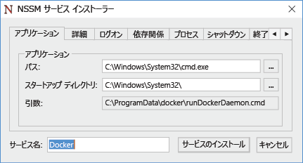
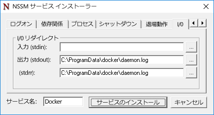

# Docker と Windows

**この記事は暫定的な内容であり、変更される可能性があります。**

Docker は、コンテナーの展開および管理プラットフォームで、Linux コンテナーと Windows コンテナーの両方で動作します。 Docker は、コンテナーとコンテナー イメージを作成、管理、削除するために使用されます。 Docker を使用すると、コンテナー イメージをパブリック レジストリ (Docker Hub) とプライベート レジストリ (Docker Trusted Registry) に格納できます。 Docker は、Docker Swarm によるコンテナー ホストのクラスタリング機能と Docker Compose による展開の自動化も提供します。 Docker と Docker ツールセットの詳細については、[Docker.com](https://www.docker.com/) を参照してください。

> Docker を使用して Windows Server と Hyper-V コンテナーの作成と管理を行うには、先に Windows コンテナー機能を有効にする必要があります。 この機能を有効にする手順については、「[Container Host Deployment Guide (コンテナー ホストの展開ガイド)](./docker_windows.md)」を参照してください。

## Windows Server

### Docker のインストール

Docker デーモンと CLI は、Windows Server または Windows Server Core に付属していません。また、Windows コンテナー機能と一緒にインストールされません。 Docker は、個別にインストールする必要があります。 このドキュメントでは、Docker デーモンと Docker クライアントの手動インストールについて説明します。 これらのタスクを完了するための自動化された方法も提供される予定です。

Docker デーモンと Docker コマンド ライン インターフェイスは、Go 言語で開発されています。 現時点で、docker.exe は Windows サービスとしてインストールされません。 Windows サービスを作成する方法はいくつかあり、ここでは `nssm.exe` を使用した 1 つの例を示します。

`https://aka.ms/tp4/docker` から docker.exe をダウンロードし、コンテナー ホストの System32 ディレクトリ内に配置します。

```powershell
PS C:\> wget https://aka.ms/tp4/docker -OutFile $env:SystemRoot\system32\docker.exe
```

`c:\programdata\docker` という名前のディレクトリを作成します。 このディレクトリ内に、`runDockerDaemon.cmd` という名前のファイルを作成します。

```powershell
PS C:\> New-Item -ItemType File -Path C:\ProgramData\Docker\runDockerDaemon.cmd -Force
```

次のテキストを `runDockerDaemon.cmd` ファイルにコピーします。 このバッチ ファイルは、コマンド `docker daemon –D –b “Virtual Switch”` を使用して Docker デーモンを起動します。 注: このファイル内の仮想スイッチの名前は、コンテナーがネットワーク接続に使用する仮想スイッチの名前と一致する必要があります。

```powershell
@echo off
set certs=%ProgramData%\docker\certs.d

if exist %ProgramData%\docker (goto :run)
mkdir %ProgramData%\docker

:run
if exist %certs%\server-cert.pem (goto :secure)

docker daemon -D -b "Virtual Switch"
goto :eof

:secure
docker daemon -D -b "Virtual Switch" -H 0.0.0.0:2376 --tlsverify --tlscacert=%certs%\ca.pem --tlscert=%certs%\server-cert.pem --tlskey=%certs%\server-key.pem
```
[https://nssm.cc/release/nssm-2.24.zip](https://nssm.cc/release/nssm-2.24.zip) から nssm.exe をダウンロードします。

```powershell
PS C:\> wget https://nssm.cc/release/nssm-2.24.zip -OutFile $env:ALLUSERSPROFILE\nssm.zip
```

ファイルを展開し、`nssm-2.24\win64\nssm.exe` を `c:\windows\system32` ディレクトリにコピーします。

```powershell
PS C:\> Expand-Archive -Path $env:ALLUSERSPROFILE\nssm.zip $env:ALLUSERSPROFILE
PS C:\> Copy-Item $env:ALLUSERSPROFILE\nssm-2.24\win64\nssm.exe $env:SystemRoot\system32
```
`nssm install` を実行し、Docker サービスを構成します。

```powershell
PS C:\> start-process nssm install
```

次のデータを NSSM サービスのインストーラー内の対応するフィールドに入力します。

[アプリケーション] タブ:

- **パス:** C:\Windows\System32\cmd.exe

- **スタートアップ ディレクトリ:** C:\Windows\System32

- **引数:** /s /c C:\ProgramData\docker\runDockerDaemon.cmd

- **サービス名:** Docker



[詳細] タブ

- **表示名:** Docker

- **説明:** Docker デーモンは、コンテナーの管理機能を docker クライアントに提供します。


[IO] タブ:

- **出力 (StdOut):** C:\ProgramData\docker\daemon.log

- **エラー (StdErr):** C:\ProgramData\docker\daemon.log




終了したら、`[サービスのインストール]` ボタンをクリックします。

これが完了すると、Windows を起動したときに Docker デーモン (サービス) も開始されます。

### Docker の削除

このガイドの手順に従って docker.exe から Windows サービスを作成している場合は、次のコマンドによりサービスが削除されます。

```powershell
PS C:\> sc.exe delete Docker

[SC] DeleteService SUCESS
```

## Nano Server

### Docker のインストール

`https://aka.ms/tp4/docker` から docker.exe をダウンロードして、Nano Server コンテナー ホストの `windows\system32` フォルダーにコピーします。

次のコマンドを実行して docker デーモンを起動します。 これはコンテナー ホストを起動するたびに実行する必要があります。 このコマンドにより、Docker デーモンが起動され、コンテナーの接続用の仮想スイッチが指定され、Docker の着信要求を ポート 2375 でリッスンするようにデーモンが設定されます。 この構成では、Docker をリモート コンピューターから管理できます。

```powershell
PS C:\> start-process cmd "/k docker daemon -D -b <Switch Name> -H 0.0.0.0:2375”
```

### Docker の削除

Nano Server から docker デーモンと cli を削除するには、Windows\system32 directory ディレクトリから `docker.exe` を削除します。

```powershell
PS C:\> Remove-Item $env:SystemRoot\system32\docker.exe
```

### 対話型 Nano セッション

> Nano Server をリモート管理する方法については、「[Getting Started with Nano Server (Nano Server の作業の開始)](https://technet.microsoft.com/en-us/library/mt126167.aspx#bkmk_ManageRemote)」を参照してください。

Nano Server ホストでコンテナーを対話的に管理している場合、このエラーが発生する可能性があります。

```powershell
docker : cannot enable tty mode on non tty input
+ CategoryInfo          : NotSpecified: (cannot enable tty mode on non tty input:String) [], RemoteException
+ FullyQualifiedErrorId : NativeCommandError 
```

これは、-it を使用して対話型セッションでコンテナーを実行しようとすると発生する場合があります。

```powershell
Docker run -it <image> <command>
```
または、実行中のコンテナーにアタッチしようとした場合も発生することがあります。

```powershell
Docker attach <container name>
```

Docker で Nano Server ホスト上に作成したコンテナーを使用して対話型セッションを作成するには、Docker デーモンをリモートで管理する必要があります。 そのためには、[ここ](https://aka.ms/ContainerTools)から docker.exe をダウンロードし、リモート システムにコピーします。

最初に、リモート コマンドを待機するように Nano Server で Docker デーモンを設定する必要があります。 それには、Nano Server で次のコマンドを実行します。

```powershell
docker daemon -D -H <ip address of Nano Server>:2375
```

次に、コンピューターで PowerShell セッションまたは CMD セッションを開き、`-H` でリモート ホストを指定して Docker コマンドを実行します。

```powershell
.\docker.exe -H tcp://<ip address of Nano Server>:2375
```

たとえば、利用可能なイメージを表示する場合は次のようにします。

```powershell
.\docker.exe -H tcp://<ip address of Nano Server>:2375 images
```


<!--HONumber=Jan16_HO3-->
