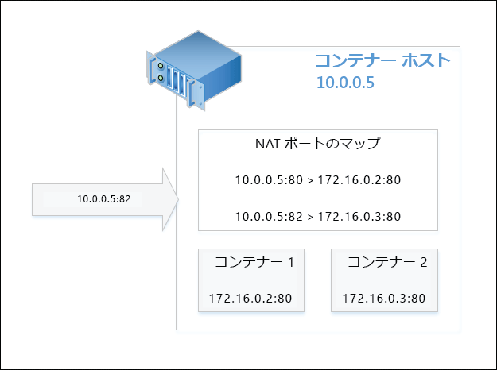
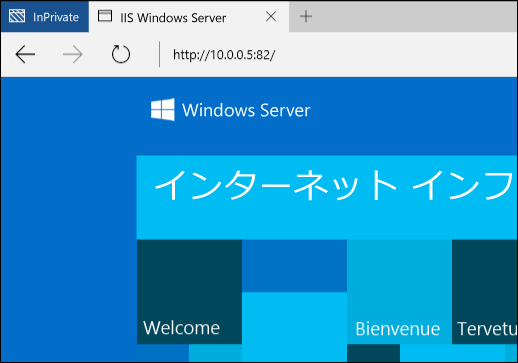

# コンテナーのネットワーク

**この記事は暫定的な内容であり、変更される可能性があります。** 

ネットワークに関して言えば、Windows コンテナーの機能は仮想マシンと似ています。 それぞれのコンテナーが仮想ネットワーク アダプターを備え、それが仮想スイッチに接続され、そこで受信トラフィックと送信トラフィックが転送されます。 コンテナーのネットワーク アダプターがインストールされている Windows Server と HYPER-V コンテナーには、同じホスト上の複数のコンテナーに分離を強制するために、ネットワーク コンパートメントがそれぞれ作成されます。 Windows Server コンテナーでは、仮想スイッチへの接続に Host vNIC を使用します。 HYPER-V コンテナーでは、仮想スイッチへの接続に (ユーティリティ VM には公開されていない) 統合 VM NIC を使用します。

Windows コンテナーでは、次の 4 つの異なるネットワーク モードをサポートしています。

- **ネットワーク アドレス変換モード**: 各コンテナーは内部の仮想スイッチに接続され、プライベート IP サブネットへの接続には WinNAT を使用します。 WinNAT は、コンテナー ホストとコンテナー自体間で、ネットワーク アドレス変換 (NAT) とポート アドレス変換 (PAT) の両方を実行します。

- **透過モード**: 各コンテナーは外部の仮想スイッチに接続され、物理ネットワークに直接接続されます。 IP アドレスは、外部の DHCP サーバーを使用して静的または動的に割り当てることができます。 未加工のコンテナーのネットワーク トラフィック フレームは、アドレス変換されずに、直接物理ネットワークに配置されます。

- **L2 ブリッジ モード**: 各コンテナーは、外部の仮想スイッチに接続されます。 同じコンテナー ホストに接続された同じ IP サブネット内の 2 つのコンテナー間のネットワーク トラフィックは直接ブリッジされます。 別の IP サブネット内または別のコンテナー ホストに接続された 2 つのコンテナー間のネットワーク トラフィックは、外部の仮想スイッチを介して送信されます。 送信時、コンテナーからのネットワーク トラフィックのソース MAC アドレスは、コンテナー ホストのものに書き直されます。 受信時、コンテナーへのネットワーク トラフィックの宛先 MAC アドレスは、コンテナー自体のものに書き直されます。

- **L2 トンネル モード** - * (このモードは Microsoft Cloud スタックでのみ使用する必要があります)*。 L2 ブリッジ モードの場合のように、各コンテナーは外部の仮想スイッチに接続され、MAC アドレスは送信時および受信時に書き直されます。 ただし、コンテナーのすべてのネットワーク トラフィックは、レイヤー 2 の接続に関係なく、物理ホストの仮想スイッチに送信されます。 これにより、(ネットワーク コントローラーやネットワーク リソース プロバイダーなど) より上位のネットワーク スタックでプログラミングされているとおり、ネットワーク ポリシーが物理ホストの仮想スイッチに強制されます。

このドキュメントでは、それぞれの利点と構成について詳しく説明します。

## ネットワークの作成

### 概要

コンテナー ネットワークの作成、コンテナーのネットワークへの接続、およびポート フォワーディング ルールの設定には、PowerShell または Docker を使用できます。 さらに、Docker のクラウド ネットワーク モデル (CNM) に基づいた Docker ネットワーク コマンドに焦点を当て説明します。

Docker ネットワークの作成に使用可能なドライバーの一覧は、'transparent'、'nat'、および 'l2bridge' です。 前述のとおり、L2 トンネル ドライバーは Microsoft Azure パブリック クラウドのデプロイメント シナリオでのみ使用してください。 

> Docker のネットワーク ドライバーは、すべて小文字です。

Docker デーモンとは、ネットワークの作成に使用されたドライバー名が使用された、別のネットワーク モードを指します。 たとえば、NAT ネットワーク モードには対応する nat という名前の Docker ネットワーク ドライバーがあります。 既定で Windows 上の Docker エンジンは、nat ドライバーがあるネットワークを探します。 NAT ネットワークが存在しない場合、Docker エンジンはそれを作成します。 作成されたすべてのコンテナーは、既定でその nat ネットワークに接続されます。

(既定で NAT ネットワーク ドライバーを使用する) この動作は、Docker デーモン エンジンの起動時に "none" という特定の "bridge" を指定する -b none オプションを使用してオーバーライドできます。

サービスを停止するには、次の PowerShell コマンドを実行します。

```none
Stop-Service docker
```

この構成ファイルは `c:\programdata\docker\runDockerDaemon.cmd` にあります。 以下の行を、次を追加して編集してください。 `-b "none"`

```none
dockerd <options> -b “none”
```

サービスを再起動します。

```none
Start-Service docker
```

'-b"none"' を使用して Docker デーモンを実行する際、コンテナーの作成および起動時に特定のネットワークを作成して参照する必要があります。

ホストで利用可能なコンテナー ネットワークを一覧表示するには、次の Docker または PowerShell コマンドを使用します。

```none
docker network ls
```
これにより、以下のように出力されます。

```none
NETWORK ID          NAME                DRIVER
bd8b691a8286        nat                 nat
7b055c7ed373        none                null
```
PowerShell では、次が同等です。


```none
Get-ContainerNetwork |fl
```

これにより、以下のように出力されます。

```none
Name               : nat
SubnetPrefix       : {172.16.0.0/12}
Gateways           : {172.16.0.1}
Id                 : 67ea1851-326d-408b-a5ef-7dcdb15c4438
Mode               : NAT
NetworkAdapterName :
SourceMac          :
DNSServers         : {10.222.118.22, 10.221.228.12, 10.222.114.67}
DNSSuffix          : corp.microsoft.com
IsDeleted          : False
```

> PowerShell では、ネットワーク モード名の大文字と小文字は区別されません。


### NAT ネットワーク

**ネットワーク アドレス変換** – このネットワーク モードは、コンテナーにすばやくプライベート IP アドレスを割り当てるのに便利です。 コンテナーへの外部アクセスは、外部 IP アドレスとポート (コンテナー ホスト) 間のポートと、内部 IP アドレスとコンテナー ポート間のマッピングによって提供されます。 外部の IP アドレスとポートの組み合わせで受信されたすべてのネットワーク トラフィックは、WinNAT ポートのマッピング テーブルと比較され、適切なコンテナーの IP アドレスとポートに転送されます。 また、NAT では、同じ (内部) 通信ポートを使用するアプリケーションを、一意の外部ポートにマッピングすることにより、複数のコンテナーでホストできます。 ホストごとに NAT ネットワーク内部プレフィックスを使用できるのは、Windows のみです。 詳細については、「[WinNAT の機能と制限事項 (ブログの投稿)](https://blogs.technet.microsoft.com/virtualization/2016/05/25/windows-nat-winnat-capabilities-and-limitations/)」をご覧ください 

> TP5 以降では、すべての NAT のポートの静的マッピングに対し、ファイアウォール規則が自動作成されます。 このファイアウォール規則は、コンテナー ホストに対してグローバルであり、特定のコンテナーのエンドポイント、またはネットワーク アダプターにはローカライズされません。

#### ホストの構成 <!--1-->

NAT ネットワーク モードを使用するには、ドライバー名が 'nat' のコンテナー ネットワークを作成します。 

> ホストごとに作成できる _nat_ 既定ネットワークは 1 つのみであるため、他のすべての NAT ネットワークを削除し、docker デーモンを '-b "none"' オプションを使用して実行した場合にのみ、新しい NAT ネットワークを作成するようにしてください。 また、単に NAT で使用する内部 IP ネットワークを制御するだけなら、_--fixed-cidr=<NAT internal prefix / mask>_ オプションを C:\ProgramData\docker\runDockerDaemon.cmd にある dockerd コマンドに追加します。

```none
docker network create -d nat MyNatNetwork [--subnet=<string[]>] [--gateway=<string[]>]
```

PowerShell を使用した NAT ネットワークを作成するには、次の構文を使用します。 PowerShell では、DNSServers や DNSSuffix などの追加のパラメーターを指定することもできます。 指定しない場合、これらの設定はコンテナー ホストから継承されます。

```none
New-ContainerNetwork -Name MyNatNetwork -Mode NAT -SubnetPrefix "172.16.0.0/12" [-GatewayAddress <address>] [-DNSServers <address>] [-DNSSuffix <string>]
```

> Windows Server 2016 Technical Preview 5 と最新の Windows Insider Preview (WIP) "flighted" ビルドには既知のバグがあります。このバグでは、新しいビルドにアップグレードすると、コンテナー ネットワークと vSwitch が重複 (「漏洩」) します。 この問題に対処するには、次のスクリプトを実行してください。
```none
PS> $KeyPath = "HKLM:\SYSTEM\CurrentControlSet\Services\vmsmp\parameters\SwitchList"
PS> $keys = get-childitem $KeyPath
PS> foreach($key in $keys)
PS> {
PS>    if ($key.GetValue("FriendlyName") -eq 'nat')
PS>    {
PS>       $newKeyPath = $KeyPath+"\"+$key.PSChildName
PS>       Remove-Item -Path $newKeyPath -Recurse
PS>    }
PS> }
PS> remove-netnat -Confirm:$false
PS> Get-ContainerNetwork | Remove-ContainerNetwork
PS> Get-VmSwitch -Name nat | Remove-VmSwitch (_failure is expected_)
PS> Stop-Service docker
PS> Set-Service docker -StartupType Disabled
Reboot Host
PS> Get-NetNat | Remove-NetNat
PS> Set-Service docker -StartupType automatic
PS> Start-Service docker 
```

### 透過ネットワーク

**透過ネットワーク** – このネットワーク モードは、コンテナーと物理ネットワークを直接接続する必要がある、非常に小さい展開でのみ使用します。 この構成で、コンテナーで実行されるすべてのネットワーク サービスは、物理ネットワークから直接アクセスされます。 IP アドレスは、物理ネットワークの IP サブネット プレフィックス内にあり、物理ネットワーク上の他の IP アドレスと競合しない場合、静的に割り当てることができます。 IP アドレスは、物理ネットワーク上の外部の DHCP サーバーから動的に割り当てることもできます。 IP の割り当てに DHCP が使用されない場合には、ゲートウェイ IP アドレスを指定できます。 

#### ホストの構成 <!--2-->

透過ネットワーク モードを使用するには、ドライバー名を 'transparent' にしてコンテナー ネットワークを作成します。 

```none
docker network create -d transparent MyTransparentNetwork
```

この例では、透過ネットワークを作成し、ゲートウェイを割り当てます。

```none
docker network create -d transparent --gateway=10.50.34.1 "MyTransparentNet"
```

コンテナーのホストが仮想化されており、IP の割り当てに DHCP を使用したい場合は、仮想マシンのネットワーク アダプターで MACAddressSpoofing を有効にする必要があります。

```none
Get-VMNetworkAdapter -VMName ContainerHostVM | Set-VMNetworkAdapter -MacAddressSpoofing On
```

> 複数の透過 (L2 ブリッジ) ネットワークを作成する場合は、外部 Hyper-V Virtual Switch (自動作成) をバインドする (仮想) ネットワーク アダプターを指定する必要があります。
 
### L2 ブリッジ ネットワーク

**L2 ブリッジ ネットワーク** - この構成では、コンテナー ホストの仮想フィルタリング プラットフォーム (VFP) の vSwitch 拡張機能がブリッジとして機能し、必要に応じてレイヤー 2 アドレス変換 (MAC アドレスの書き直し) を実行します。 レイヤー 3 の IP アドレスおよびレイヤー 4 のポートは変更されません。 物理ネットワークの IP サブネット プレフィックスに対応するよう、または Microsoft のプライベート クラウドを展開している場合には、仮想ネットワークのサブネット プレフィックスの IP を使用して、IP アドレスを静的に割り当てることができます。

#### ホストの構成 <!--3-->

L2 ブリッジ ネットワーク モードを使用するには、ドライバー名を 'l2bridge' にして、コンテナー ネットワークを作成します。 L2 ブリッジ ネットワークを作成する際には、サブネットとゲートウェイも指定する必要があります。

```none
docker network create -d l2bridge --subnet=192.168.1.0/24 --gateway=192.168.1.1 MyBridgeNetwork
```

## ネットワークの削除

コンテナー ネットワークを削除するには、`docker network rm` を使用します。

```none
docker network rm "<network name>"
```
または PowerShell には `Remove-ContainerNetwork` を使用します。

これはコンテナー ネットワークが使用したすべての HYPER-V 仮想スイッチと、nat コンテナー ネットワーク用に作成されたすべてのネットワーク アドレス変換オブジェクトをクリーンアップします。

## ネットワーク オプション

コンテナー ネットワークの作成時またはコンテナー自体の作成時には、別のネットワーク オプションを指定できます。 コンテナー ネットワークを作成する際には、ネットワーク モードを指定する -d (--driver=<network mode>) オプションに加え、--gateway、--subnet、-o オプションも使用できます。

### 追加オプション

ゲートウェイ IP アドレスは `--gateway` を使用して指定できます。 これは、静的に割り当てた IP を使用する場合のみ (透過ネットワーク) 行います。

```none
docker network create -d transparent --gateway=10.50.34.1 "MyTransparentNet"
```

IP サブネットのプレフィックスは、IP アドレスが割り当てられるネットワーク セグメントを制御する `--subnet` を使用して指定できます。

```none
docker network create -d nat --subnet=192.168.0.0/24 "MyCustomNatNetwork"
```
コンテナー ネットワークをさらにカスタマイズするには、Docker で -o (--opt=map[]) パラメーターを使用します。 

透過、L2 ブリッジ、または L2 トンネル ネットワークに使用するコンテナー ホストのネットワーク アダプターの指定には、*com.docker.network.windowsshim.interface* オプションを使用します。 
```none
docker network create -d transparent -o com.docker.network.windowsshim.interface="Ethernet 2" "TransparentNetTwo"
```

*com.docker.network.windowsshim.interface* の値は、次の方法で取得したアダプターの *Name* です。 
```none
Get-NetAdapter
```

> Docker で、PowerShell を使用して作成したコンテナー ネットワークは、Docker デーモンを再起動するまで使用できません。 PowerShell を使用してコンテナー ネットワークに、これ以外の変更を加えた場合も、Docker デーモンの再起動が必要です。

### 複数のコンテナー ネットワーク

以下のことに注意して、1 つのコンテナー ホストに複数のコンテナー ネットワークを作成できます。
* 1 つのコンテナー ホストには、NAT ネットワークを 1 つのみ作成できます。
* 複数のネットワーク (例: 透過、L2 ブリッジ、または L2 トンネル) が接続に外部の vSwitch を使用する場合、それぞれが独自のネットワーク アダプターを使用する必要があります。

### ネットワークの選択

Windows コンテナーの作成時、コンテナーのネットワーク アダプターを接続するネットワークを指定できます。 ネットワークを指定しない場合、既定 NAT ネットワークが使用されます。

コンテナーを既定以外の NAT ネットワークに接続するには (または ‐b "none" が使用されている場合には)、Docker の run コマンドで --net オプションを使用します。

```none
docker run -it --net=MyTransparentNet windowsservercore cmd
```

### 静的 IP アドレス

静的 IP アドレスは、NAT、透過、([PR](https://github.com/docker/docker/pull/22208) は保留)、L2 ブリッジ ネットワークのモードでのみサポートされ、コンテナーのネットワーク アダプターに設定します。 また、既定の"nat" ネットワークに Docker を使用して静的な IP を割り当てることはできません。

```none
docker run -it --net=MyTransparentNet --ip=10.80.123.32 windowsservercore cmd
```

静的な IP の割り当ては、コンテナーのネットワーク アダプターに対して直接行い、コンテナーが停止状態にある場合にのみ実行する必要があります。 コンテナーの実行中は、コンテナーのネットワーク アダプターの "ホット アド" またはネットワーク スタックに対する変更は実行できません。

```none
Get-ContainerNetworkAdapter -ContainerName "DemoNAT"

ContainerName Name            Network Id                           Static MacAddress Static IPAddress Maximum Bandwidth
------------- ----            ----------                           ----------------- ---------------- -----------------
DemoNAT       Network Adapter C475D31C-FB42-408E-8493-6DB6C9586915                              0

Set-ContainerNetworkAdapter -ContainerName "DemoNAT" -StaticIPAddress 172.16.0.100
```

コンテナー ネットワークのサブネット プレフィックスに指定されている範囲から IP アドレスを自動的に選択するには、コンテナーのネットワーク アダプターに設定をまったく適用せず、コンテナーを起動します。

> PowerShell では、透過ネットワークに接続されているコンテナーのエンドポイントには静的な IP アドレスを割り当てることはできません。

特定のネットワークに接続されているコンテナー、またこれらのコンテナーのエンドポイントに関連付けられている IP を確認するには、次を実行します。

```none
docker network inspect nat
```

### MAC アドレスの作成

MAC アドレスは、`--mac-address` オプションを使用して指定することができます。

```none
docker run -it --mac="92:d0:c6:0a:29:33" --name="MyContainer" windowsservercore cmd
```

### ポートのマッピング

NAT ネットワークに接続されているコンテナー内のアプリケーションにアクセスするには、コンテナー ホストとコンテナー ネットワーク アダプター間にポート マッピングを作成する必要があります。 これらのマッピングは、コンテナーが停止状態のときに作成する必要があります。

この例では、コンテナー ホストのポート **80** とコンテナーのポート **80** の間に静的なマッピングを作成します。

```none
docker run -it --name=DemoNat -p 80:80 windowsservercore cmd
```

この例では、コンテナー ホストのポート **8082** とコンテナーのポート **80** の間に静的なマッピングを作成します。

```none
docker run -it --name=DemoNat -p 8082:80 windowsservercore cmd
```

Docker を使用しても、ポートを動的にマッピングできます。この場合、ユーザーはマップする特定のポートをコンテナー ホストから指定する必要がありません。 コンテナー ホストで一時的なポートがランダムに選択され、Docker ps の実行時に検査されます。

```none
docker run -itd --name=DemoNat -p 80 windowsservercore cmd

docker ps
CONTAINER ID        IMAGE               COMMAND             CREATED             STATUS              PORTS                   NAMES
bbf72109b1fc        windowsservercore   "cmd"               6 seconds ago       Up 2 seconds        *0.0.0.0:14824->80/tcp*   DemoNat
```

この例では、DemoNat コンテナーの TCP ポート 80 が、ポート 14824 のコンテナー ホストから外部に公開されています。

ポート マッピングの作成後、コンテナーのホスト (物理または仮想) に割り当てられている IP アドレスと公開されている外部ポートを使用して、コンテナーのアプリケーションにアクセスすることができます。 たとえば、以下の図は、コンテナー ホストの外部ポート **82** を要求の宛先とした NAT 構成を表しています。 この要求は、ポート マッピングに基づいて、コンテナー 2 でホストされているアプリケーションを返します。



以下の図は、この要求をインターネット ブラウザーから見たところです。



## 注意事項と潜在的な問題

### ファイアウォール

ICMP (Ping) と DHCP を有効にするには、コンテナー ホストに特定のファイアウォール規則を作成する必要があります。 同じホスト上の 2 つのコンテナー間を ping したり、動的に割り当てられた IP アドレスを DHCP を介して受け取ったりするには、Windows Server コンテナーに ICMP と DHCP が必要です。 TP5 では、Install-ContainerHost.ps1 スクリプトを使用してこれらの規則を作成します。 Post-TP5 では、これらの規則は自動的に作成されます。 NAT ポート転送ルールに対応するすべてのファイアウォール規則は自動的に作成され、コンテナーが停止されるときにクリーンアップされます。

### サポートされていない機能

現在、Docker CLI では次のネットワーク機能はサポートされていません。
 * コンテナーのリンク (例: --link)
 * コンテナーの名前での IP 解決

現在、Windows Docker では次のネットワーク オプションはサポートされていません。
 * --add-host
 * --dns
 * --dns-opt
 * --dns-search
 * -h､--hostname
 * --net-alias
 * --aux-address
 * --internal
 * --ip-range


<!--HONumber=Jul16_HO5-->


