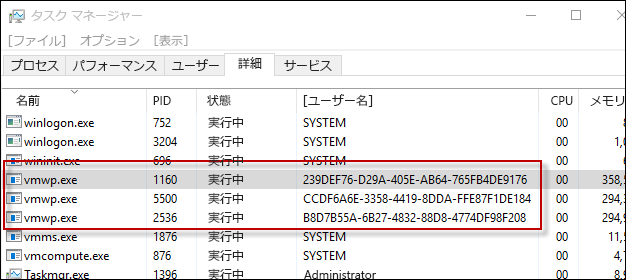

# Hyper-V コンテナー

**この記事は暫定的な内容であり、変更される可能性があります。**

Windows コンテナー テクノロジには、Windows Server コンテナーと Hyper-V コンテナーの 2 種類があります。 どちらのコンテナーの作成方法、管理方法、および機能も同じです。 違うのは、コンテナー、ホスト オペレーティング システム、およびそのホストで実行されているその他のコンテナーとの間で作成される分離レベルです。

**Windows Server コンテナー** – 名前空間とプロセスの分離テクノロジによって提供される分離により、ホスト上で複数のコンテナーが実行されます。

**Hyper-V コンテナー** – ホスト上で複数のコンテナーを実行しますが、各コンテナーは、ユーティリティ仮想マシン内で実行されます。 これにより、Hyper-V コンテナー、コンテナー ホスト、およびコンテナー ホストで実行されているその他の任意のとコンテナーとの間でカーネル レベルの分離が提供されます。

## Hyper V コンテナー PowerShell

### コンテナーの作成

Hyper-V コンテナーは、Widows Server コンテナーとまったく同じに作成されますが、ランタイム パラメーターが Hyper-V コンテナーになることを示している点だけが異なります。

PowerShell を使用した Hyper-V コンテナーの作成例

```powershell
PS C:\> $con = New-Container -Name HYPVCON -ContainerImageName NanoServer -SwitchName "Virtual Switch" -RuntimeType HyperV
```

### コンテナーの変換

ビルド時に Hyper-V コンテナーとしてコンテナーを作成することに加え、PowerShell を使用して作成されたコンテナーは、Windows Server コンテナーから Hyper-V コンテナーに変換することもできます。

>現在、コンテナーのランタイム変換をサポートしているホスト オペレーティング システムは、Nano Server だけです。

既定のランタイムで新しいコンテナーを作成します。

```powershell
PS C:\> New-Container -Name DEMO -ContainerImageName nanoserver -SwitchName NAT
```
コンテナーから、ランタイム プロパティを返します。ランタイムが既定値として設定されていることに注目してください。

```powershell
PS C:\> Get-Container | Select ContainerName, RuntimeType

ContainerName RuntimeType
------------- -----------
DEMO              Default
```

`set-container` コマンドを使用して、コンテナー ランタイムを変更します。

```powershell
PS C:\> Set-Container $con -RuntimeType HyperV
```

最後にもう一度ランタイム プロパティを返して変更を確認します。

```powershell
PS C:\> Get-Container | select ContainerName, RuntimeType

ContainerName RuntimeType
------------- -----------
DEMO               HyperV
```

## Hyper-V コンテナー Docker

### コンテナーの作成

Docker を使用した Hyper-V コンテナーの管理は、Windows Server コンテナーの管理とほぼ同じです。 Docker を使用して Hyper-V コンテナーを作成する場合には、`-isolation=hyperv` パラメーターを使用します。

```powershell
docker run -it --isolation=hyperv 646d6317b02f cmd
```

## 内部構造

### VM ワーカー プロセス

作成される Hyper-V コンテナーごとに、対応する仮想マシン ワーカー プロセスが作成されます。

```powershell
PS C:\> Get-Container | Select Name, RuntimeType, ContainerID | Where {$_.RuntimeType -eq 'Hyperv'}

Name RuntimeType ContainerId
---- ----------- -----------
TST3      HyperV 239def76-d29a-405e-ab64-765fb4de9176
TST       HyperV b8d7b55a-6b27-4832-88d8-4774df98f208
TST2      HyperV ccdf6a6e-3358-4419-8dda-ffe87f1de184
```

コンテナー ID とプロセスのユーザー名で、コンテナーとプロセスとを照合できることに注意してください。



この関係は、`Get-ComputeProcess` コマンドを使用して表示することもできます。

```powershell
PS C:\> Get-ComputeProcess

Id                                   Name Owner      Type
--                                   ---- -----      ----
239DEF76-D29A-405E-AB64-765FB4DE9176 TST3 VMMS  Container
B8D7B55A-6B27-4832-88D8-4774DF98F208 TST  VMMS  Container
CCDF6A6E-3358-4419-8DDA-FFE87F1DE184 TST2 VMMS  Container
```

`Get-ComputeProcess` コマンドの詳細については、「[管理相互運用性](./hcs_powershell.md)」を参照してください。

## 分離のデモ

### Windows Server コンテナー

次の演習は、Hyper-V コンテナーの分離を示すために使用できます。 この演習では、Windows Server コンテナーと Hyper-V コンテナーの両方が作成されます。 コンテナー ホストで実行中のプロセスが検査され、Windows Server コンテナー プロセスがコンテナー ホスト上でどのように共有されているかが示されますが、Hyper-V コンテナー プロセスについては示されません。

```powershell
PS C:\> get-process | where {$_.ProcessName -eq 'csrss'}

Handles  NPM(K)    PM(K)      WS(K) VM(M)   CPU(s)     Id  SI ProcessName
-------  ------    -----      ----- -----   ------     --  -- -----------
    255      12     1820       4000 ...98     0.53    532   0 csrss
    116      11     1284       3700 ...94     0.25    608   1 csrss
    246      13     1844       5504 ...17     3.45   3484   2 csrss
```

新しい Windows Server コンテナーを作成します。

```powershell
PS C:\> New-Container -Name WINCONT -ContainerImageName WindowsServerCore -SwitchName "Virtual Switch"
```

コンテナーを起動します。

```powershell
PS C:\> Start-Container $con
```

コンテナーを使用してリモート PS セッションを作成します。

```powershell
PS C:\> Enter-PSSession -ContainerId $con.ContainerId –RunAsAdministrator
```

リモート コンテナー セッションから csrss というプロセス名を持つすべてのプロセスを返します。 実行中の csrss プロセスのプロセス ID (次の例では 1228) を書き留めておきます。

```powershell
[WINCONT]: PS C:\> get-process | where {$_.ProcessName -eq 'csrss'}

Handles  NPM(K)    PM(K)      WS(K) VM(M)   CPU(s)     Id  SI ProcessName
-------  ------    -----      ----- -----   ------     --  -- -----------
    167       9     1276       3720 ...97     0.20   1228   3 csrss
```

次に、コンテナー ホストから csrss プロセス フォームの一覧を返します。 同じ csrss プロセスが、コンテナー ホストからも返されることに注目してください。

```powershell
PS C:\> get-process | where {$_.ProcessName -eq 'csrss'}

Handles  NPM(K)    PM(K)      WS(K) VM(M)   CPU(s)     Id  SI ProcessName
-------  ------    -----      ----- -----   ------     --  -- -----------
    252      11     1712       3968 ...98     0.53    532   0 csrss
    113      11     1176       3676 ...93     0.25    608   1 csrss
    175       9     1260       3708 ...97     0.20   1228   3 csrss
    243      13     1736       5512 ...17     3.77   3484   2 csrss
```
### Hyper-V コンテナー

コンテナー ホストから csrss プロセス フォームの一覧を返します。

```powershell
PS C:\> get-process | where {$_.ProcessName -eq 'csrss'}

Handles  NPM(K)    PM(K)      WS(K) VM(M)   CPU(s)     Id  SI ProcessName
-------  ------    -----      ----- -----   ------     --  -- -----------
    261      12     1820       4004 ...98     0.53    532   0 csrss
    116      11     1284       3704 ...94     0.25    608   1 csrss
    246      13     1844       5536 ...17     3.83   3484   2 csrss
```

次に、Hyper-V コンテナーを作成します。

```powershell
PS C:\> $con = New-Container -Name HYPVCON -ContainerImageName NanoServer -SwitchName "Virtual Switch" -RuntimeType HyperV
```

Hyper V コンテナーを起動します。

```powershell
PS C:\> Start-Container $con
```

Hyper-V コンテナーを使用してリモート PS セッションを作成します。

```powershell
PS C:\> Enter-PSSession -ContainerId $con.ContainerId –RunAsAdministrator
```

Hyper-V コンテナー内で実行されている csrss プロセスの一覧を返します。 csrss プロセスのプロセス ID (次の例では 956) を書き留めておきます。

```powershell
[HYPVCON]: PS C:\> get-process | where {$_.ProcessName -eq 'csrss'}

Handles  NPM(K)    PM(K)      WS(K) VM(M)   CPU(s)     Id  SI ProcessName
-------  ------    -----      ----- -----   ------     --  -- -----------
              4      452       1520 ...63     0.06    956   1 csrss
```

次に、コンテナー ホスト上の csrss プロセスの一覧を返します。 csrss プロセスがコンテナー内とコンテナー ホストからも確認できた Windows Server コンテナーとは異なり、Hyper-V コンテナー プロセスは、そのコンテナー内からしか確認できません。 これは、Hyper-V コンテナーがユーティリティ仮想マシンにカプセル化され、プロセスがそのユーティリティ仮想マシンに分離されているためです。

```powershell
PS C:\> get-process | where {$_.ProcessName -eq 'csrss'}

Handles  NPM(K)    PM(K)      WS(K) VM(M)   CPU(s)     Id  SI ProcessName
-------  ------    -----      ----- -----   ------     --  -- -----------
    255      12     1716       3972 ...98     0.56    532   0 csrss
    113      11     1176       3676 ...93     0.25    608   1 csrss
    243      13     1732       5512 ...18     4.23   3484   2 csrss
```


<!--HONumber=Jan16_HO1-->
