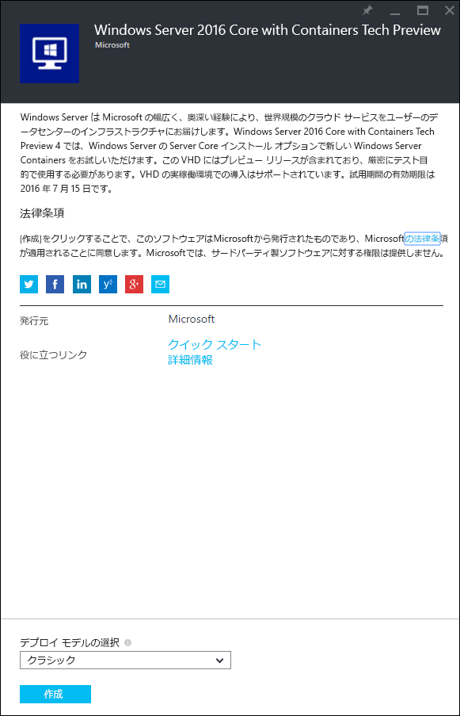
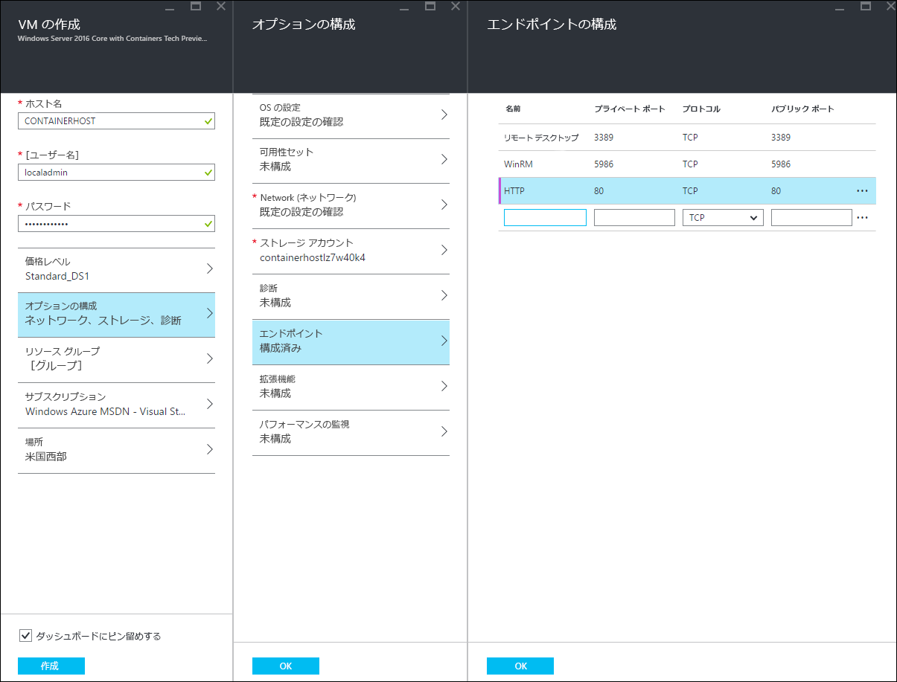
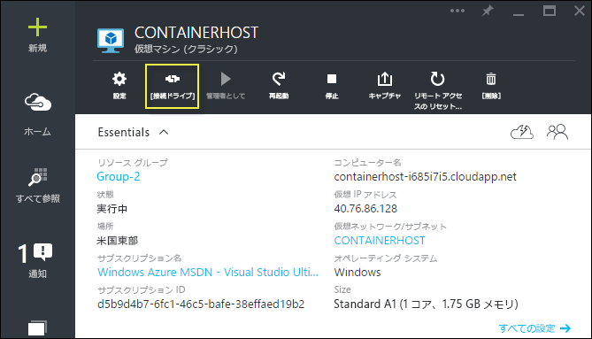

# Azure クイック スタート

Azure で Windows Server コンテナーの作成と管理をするには、事前に、Windows Server コンテナー機能にあらかじめ構成されている Windows Server 2016 Technical Preview イメージを展開する必要があります。 このガイドでは、このプロセスについて説明します。

> Microsoft Azure は、Hyper-V コンテナーをサポートしていません。 Hyper-V コンテナーの演習を完了するには、オンプレミスのコンテナー ホストが必要です。

## Azure ポータルの使用を開始する

Azure アカウントをお持ちの場合は、この手順をスキップして[コンテナー ホスト VM の作成](#CreateacontainerhostVM)に移動します。

1. [azure.com](https://azure.com) に移動して、[Azure 無料試用版](https://azure.microsoft.com/en-us/pricing/free-trial/)の手順に従います。
2. Microsoft アカウントを使用してサインインします。
3. ご自分のアカウントが利用できる場合は、[Azure 管理ポータル](https://portal.azure.com)にサインインします。

## コンテナー ホスト VM の作成

Azure Marketplace で検索で「containers」を検索すると、「Windows Server 2016 Core with Containers Tech Preview 4」という検索結果が返されます。

イメージを選択し、`[作成]` をクリックします。

仮想マシンの名前を指定し、ユーザー名とパスワードを選択します。

[オプションの構成]、[エンドポイント] の順に選択し、以下に示すように、プライベート ポートとパブリック ポートが 80 の HTTP エンドポイントを入力します。 完了したら、[OK] を 2 回クリックします。

`[作成]` ボタンを選択して、仮想マシンの展開プロセスを開始します。

VM の展開が完了したら、[接続] ボタンを選択し、Windows Server コンテナー ホストとの RDP セッションを開始します。

VM の作成ウィザードで指定したユーザー名とパスワードを使用して、VM にログインします。 ログインすると、Windows コマンド プロンプトが表示されます。

## ビデオ チュートリアル

<iframe src="https://channel9.msdn.com/Blogs/containers/Quick-Start-Configure-Windows-Server-Containers-in-Microsoft-Azure/player#ccLang=ja" width="800" height="450"  allowFullScreen="true" frameBorder="0" scrolling="no"></iframe>

## 次の手順 - コンテナーの使用開始

これで Windows Server コンテナーの機能を実行する Windows Server 2016 システムが準備できたので、Windows Server コンテナーおよび Windows Server コンテナー イメージの使用を開始するため、次のガイドに移動します。

[Quick Start: Windows Containers and Docker (クイック スタート: Windows コンテナーと Docker)](./manage_docker.md)  
[Quick Start: Windows Containers and PowerShell (クイック スタート: Windows コンテナーと PowerShell)](./manage_powershell.md)

