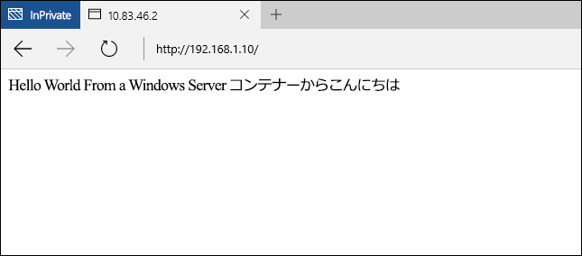

# Windows コンテナー クイック スタート -Docker

Windows コンテナーを使用すると、単一のコンピューター システムに多数の独立したアプリケーションを短時間で展開できます。 この演習では、Docker を使用した Windows コンテナーの作成と管理の方法を示します。 完了すると、Docker と Windows コンテナーを統合する方法の基本的な理解が得られ、テクノロジを実際に体験できるはずです。

このチュートリアルでは、Windows Server コンテナーと Hyper-V コンテナーの両方について説明します。 コンテナーの種類によって基本要件は異なります。 Windows コンテナー ドキュメントには、コンテナー ホストを簡単にデプロイする手順が記載されています。 Windows コンテナーを初めて使用するときは、これが最も簡単な方法です。 コンテナー ホストをお持ちでない場合は、[コンテナー ホストの展開のクイック スタート](./container_setup.md)に関するページを参照してください。

各演習には、次の項目が必要です。

**Windows サーバー コンテナー:**

- オンプレミスまたは Azure で Windows Server 2016 (Full または Core) を実行している Windows コンテナー ホスト。

**Hyper-V コンテナー:**

- 仮想化の入れ子に対応した Windows コンテナー ホスト。
- Windows Server 2016 メディア - [ダウンロード](https://aka.ms/tp4/serveriso)。

>Microsoft Azure は、Hyper-V コンテナーをサポートしていません。 Hyper-V コンテナーの演習を実行するには、オンプレミスのコンテナー ホストが必要です。

## Windows Server コンテナー

Windows Server コンテナーは、アプリケーションとホスト プロセスを実行するための、独立した、移植可能な、リソースが制御された運用環境を提供します。 Windows Server コンテナーを使用すると、プロセスと名前空間の分離によって、コンテナーとホスト間を分離できます。

### コンテナーの作成

コンテナーを作成する前に、`docker images` コマンドを使用して、ホストにインストールされているコンテナー イメージを一覧表示します。

```powershell
PS C:\> docker images

REPOSITORY          TAG                 IMAGE ID            CREATED             VIRTUAL SIZE
windowsservercore   10.0.10586.0        6801d964fda5        2 weeks ago         0 B
windowsservercore   latest              6801d964fda5        2 weeks ago         0 B
nanoserver          10.0.10586.0        8572198a60f1        2 weeks ago         0 B
nanoserver          latest              8572198a60f1        2 weeks ago         0 B
```

この例では、Windows Server Core イメージを使用してコンテナーを作成します。 これは、`docker run コマンド`で行います。 `docker run` の詳細については、[docker.com の Docker Run リファレンス](https://docs.docker.com/engine/reference/run/)を参照してください。

この例では、`iisbase` という名前のコンテナーを作成し、コンテナーとの対話型セッションを開始します。

```powershell
C:\> docker run --name iisbase -it windowsservercore cmd
```

コンテナーが作成されたら、コンテナー内からシェル セッションで操作します。


### IIS イメージの作成

IIS がインストールされ、次に、コンテナーからイメージが作成されます。 IIS をインストールするには、次のコマンドを実行します。

```powershell
C:\> powershell.exe Install-WindowsFeature web-server
```

完了したら、対話型シェル セッションを終了します。

```powershell
C:\> exit
```

最後に、`docker commit` を使用して、コンテナーを新しいコンテナー イメージにコミットします。 この例では、`windowsservercoreiis` という名前で新しいコンテナー イメージを作成します。

```powershell
C:\> docker commit iisbase windowsservercoreiis
4193c9f34e320c4e2c52ec52550df225b2243927ed21f014fbfff3f29474b090
```

新しい IIS イメージを表示するには、`docker images` コマンドを使用します。

```powershell
C:\> docker images

REPOSITORY             TAG                 IMAGE ID            CREATED             VIRTUAL SIZE
windowsservercoreiis   latest              4193c9f34e32        4 minutes ago       170.8 MB
windowsservercore      10.0.10586.0        6801d964fda5        2 weeks ago         0 B
windowsservercore      latest              6801d964fda5        2 weeks ago         0 B
nanoserver             10.0.10586.0        8572198a60f1        2 weeks ago         0 B
nanoserver             latest              8572198a60f1        2 weeks ago         0 B
```

### ネットワークの構成

Docker でコンテナーを作成する前に、コンテナーへのネットワーク接続を許可する Windows ファイアウォールのルールを作成する必要があります。 次を実行して、ポート 80 のルールを作成します。

```powershell
if (!(Get-NetFirewallRule | where {$_.Name -eq "TCP80"})) {
    New-NetFirewallRule -Name "TCP80" -DisplayName "HTTP on TCP/80" -Protocol tcp -LocalPort 80 -Action Allow -Enabled True
}
```

コンテナー ホスト IP アドレスを書き留めておく必要がある場合もあります。 これは、この演習を通して使用します。

### IIS コンテナーの作成

IIS 対応の運用環境を展開するために使用できる、IIS を含むコンテナー イメージが作成されました。

新しいイメージからコンテナーを作成するには、`docker run` コマンドを使用します。今回は IIS のイメージの名前を指定します。 この例ではパラメーター `-p 80:80` を指定していることに注意してください。 コンテナーは、ネットワーク アドレス変換を介して、IP を提供している仮想スイッチに接続されているため、ポートはコンテナー ホストから、コンテナーの NAT IP アドレス上のポートにマップされる必要があります。 `-p` の詳細については、[docker.com の Docker Run リファレンス](https://docs.docker.com/engine/reference/run/)を参照してください。

```powershell
C:\> docker run --name iisdemo -it -p 80:80 windowsservercoreiis cmd
```

コンテナーが作成されたら、ブラウザーを開いて、コンテナー ホストの IP アドレスを参照します。 ホストのポート 80 はコンテナーのポート 80 にマップされているため、IIS スプラッシュ画面が表示されるはずです。


### アプリケーションの作成

次のコマンドを実行して、IIS スプラッシュ画面を削除します。

```powershell
C:\> del C:\inetpub\wwwroot\iisstart.htm
```

次のコマンドを実行して、既定の IIS サイトを新しい静的サイトに置き換えます。

```powershell
C:\> echo "Hello World From a Windows Server Container" > C:\inetpub\wwwroot\index.html
```

再びコンテナー ホストの IP アドレスにアクセスすると、"Hellow World" アプリケーションが表示されます。 注: 更新されたアプリケーションを表示するには、既存のブラウザー接続を閉じたり、ブラウザー キャッシュをクリアしたりする必要がある場合があります。



コンテナーとの対話型セッションを終了します。

```powershell
C:\> exit
```

コンテナーの削除

```powershell
C:\> docker rm iisdemo
```
IIS イメージを削除します。

```powershell
C:\> docker rmi windowsservercoreiis
```

## Dockerfile

前回の演習によって、コンテナーが手動で作成され、変更されて、新しいコンテナー イメージにキャプチャされています。 Docker には、このプロセスを自動化するためのメソッドが含まれており、dockerfile と呼ばれるものを使用します。 この演習は前回と同じ結果になりますが、今回はプロセスが完全に自動化されます。

### IIS イメージの作成

コンテナー ホストで、ディレクトリ `c:\build` を作成し、このディレクトリ内に `dockerfile` という名前のファイルを作成します。

```powershell
C:\> powershell new-item c:\build\dockerfile -Force
```

メモ帳で、dockerfile を開きます。

```powershell
C:\> notepad c:\build\dockerfile
```

dockerfile に次のテキストをコピーし、ファイルを保存します。 これらのコマンドは、`windosservercore` をベースとして使用して新しいイメージを作成し、`RUN` で指定した変更を加えるように Docker に指示します。 Dockerfile の詳細については、[docker.com の Dockerfile リファレンス](http://docs.docker.com/engine/reference/builder/)を参照してください。

```powershell
FROM windowsservercore
RUN dism /online /enable-feature /all /featurename:iis-webserver /NoRestart
RUN echo "Hello World - Dockerfile" > c:\inetpub\wwwroot\index.html
```

このコマンドは、自動化されたイメージ ビルド プロセスを開始します。 `-t` パラメーターは、新しいイメージに `iis` という名前を付けるようにプロセスに指示します。

```powershell
C:\> docker build -t iis c:\Build
```

完了したら、`docker images` コマンドを使用して、イメージが作成されたことを確認できます。

```powershell
C:\> docker images

REPOSITORY          TAG                 IMAGE ID            CREATED             VIRTUAL SIZE
iis                 latest              abb93867b6f4        26 seconds ago      209 MB
windowsservercore   10.0.10586.0        6801d964fda5        2 weeks ago         0 B
windowsservercore   latest              6801d964fda5        2 weeks ago         0 B
nanoserver          10.0.10586.0        8572198a60f1        2 weeks ago         0 B
nanoserver          latest              8572198a60f1        2 weeks ago         0 B
```

### IIS コンテナーの展開

ここで、前回の演習と同様に、コンテナーを展開し、ホストのポート 80 をコンテナーのポート 80 にマップします。

```powershell
C:\> docker run --name iisdemo -it -p 80:80 iis cmd
```

コンテナーが作成されたら、コンテナー ホストの IP アドレスを参照します。 hello world アプリケーションが表示されるはずです。


コンテナーとの対話型セッションを終了します。

```powershell
C:\> exit
```

コンテナーの削除

```powershell
C:\> docker rm iisdemo
```
IIS イメージを削除します。

```powershell
C:\> docker rmi iis
```

## Hyper-V コンテナー

Hyper-V コンテナーは、Windows Server コンテナー上に分離したレイヤーを追加します。 各 Hyper-V コンテナーは、高度に最適化された仮想マシン内に作成されます。 Windows Server コンテナーは、コンテナー ホストとカーネルを共有しますが、Hyper-V コンテナーは完全に分離されています。 Hyper-V コンテナーは、Windows Server コンテナーと全く同じように作成および管理されます。 Hyper-V コンテナーの詳細については、[Hyper-V コンテナーの管理](../management/hyperv_container.md)に関するページを参照してください。

>Microsoft Azure は、Hyper-V コンテナーをサポートしていません。 Hyper-V の演習を実行するには、オンプレミスのコンテナー ホストが必要です。

### コンテナーの作成

コンテナーは Nano Server OS イメージを実行するため、IIS をインストールするために、Nano Server IIS パッケージが必要です。 これらのパッケージは、Windows Server 2016 TP4 インストール メディアの `NanoServer\Packages` ディレクトリにあります。

この例では、`docker run` の `-v` パラメーターを使用して、実行中のコンテナーからコンテナー ホストのディレクトリを使用できるようにします。 これを行う前にソース ディレクトリを構成する必要があります。

コンテナー ホスト上にコンテナーで共有されるディレクトリを作成します。 PowerShell チュートリアルを既に完了している場合は、このディレクトリと必要なファイルが既に存在している可能性があります。

```powershell
C:\> powershell New-Item -Type Directory c:\share\en-us
```

`Microsoft-NanoServer-IIS-Package.cab` を `NanoServer\Packages` からコンテナー ホストの `c:\share` にコピーします。

`NanoServer\Packages\en-us\Microsoft-NanoServer-IIS-Package.cab` をコンテナー ホストの `c:\share\en-us` にコピーします。

c:\share フォルダーに unattend.xml という名前のファイルを作成し、次のテキストを unattend.xml ファイルにコピーします。

```powershell
<?xml version="1.0" encoding="utf-8"?>
<unattend xmlns="urn:schemas-microsoft-com:unattend">
    <servicing>
        <package action="install">
            <assemblyIdentity name="Microsoft-NanoServer-IIS-Package" version="10.0.10586.0" processorArchitecture="amd64" publicKeyToken="31bf3856ad364e35" language="neutral" />
            <source location="c:\iisinstall\Microsoft-NanoServer-IIS-Package.cab" />
        </package>
        <package action="install">
            <assemblyIdentity name="Microsoft-NanoServer-IIS-Package" version="10.0.10586.0" processorArchitecture="amd64" publicKeyToken="31bf3856ad364e35" language="en-US" />
            <source location="c:\iisinstall\en-us\Microsoft-NanoServer-IIS-Package.cab" />
        </package>
    </servicing>
</unattend>
```

完了すると、コンテナー ホストの `c:\share` ディレクトリが次のように構成されます。

```
c:\share
|-- en-us
|    |-- Microsoft-NanoServer-IIS-Package.cab
|
|-- Microsoft-NanoServer-IIS-Package.cab
|-- unattend.xml
```

docker を使用して Hyper-V コンテナーを作成するには、`--isolation=hyperv` パラメーターを指定します。 この例では、ホストの `c:\share` ディレクトリをコンテナーの `c:\iisinstall` ディレクトリにマウントしてから、コンテナーとの対話型シェル セッションを作成します。

```powershell
C:\> docker run --name iisnanobase -it -v c:\share:c:\iisinstall --isolation=hyperv nanoserver cmd
```

### IIS イメージの作成

コンテナー シェル セッション内から、`dism` を使用して、IIS をインストールできます。 次のコマンドを実行して、コンテナーに IIS をインストールします。

```powershell
C:\> dism /online /apply-unattend:c:\iisinstall\unattend.xml
```

IIS のインストールが完了したら、次のコマンドを使用して手動で IIS を起動します。

```powershell
C:\> Net start w3svc
```

コンテナー セッションを終了します。

```powershell
C:\> exit
```

### IIS コンテナーの作成

変更した Nano Server コンテナーを、新しいコンテナー イメージにコミットできるようになりました。 これを行うには、`docker commit` コマンドを使用します。

```powershell
C:\> docker commit iisnanobase nanoserveriis
```

結果は、コンテナー イメージの一覧が返されたときに確認できます。

```powershell
C:\> docker images

REPOSITORY          TAG                 IMAGE ID            CREATED              VIRTUAL SIZE
nanoserveriis       latest              444435a4e30f        About a minute ago   69.14 MB
windowsservercore   10.0.10586.0        6801d964fda5        2 weeks ago          0 B
windowsservercore   latest              6801d964fda5        2 weeks ago          0 B
nanoserver          10.0.10586.0        8572198a60f1        2 weeks ago          0 B
nanoserver          latest              8572198a60f1        2 weeks ago          0 B
```

### アプリケーションの作成

Nano Server IIS イメージを新しいコンテナーに展開できるようになりました。

```powershell
C:\> docker run -it -p 80:80 --isolation=hyperv nanoserveriis cmd
```

次のコマンドを実行して、IIS スプラッシュ画面を削除します。

```powershell
C:\> del C:\inetpub\wwwroot\iisstart.htm
```

次のコマンドを実行して、既定の IIS サイトを新しい静的サイトに置き換えます。

```powershell
C:\> echo "Hello World From a Hyper-V Container" > C:\inetpub\wwwroot\index.html
```

コンテナー ホストの IP アドレスを参照すると、"Hellow World" アプリケーションが表示されるようになったはずです。 注: 更新されたアプリケーションを表示するには、既存のブラウザー接続を閉じたり、ブラウザー キャッシュをクリアしたりする必要がある場合があります。


コンテナーとの対話型セッションを終了します。

```powershell
C:\> exit
```


<!--HONumber=Jan16_HO1-->
