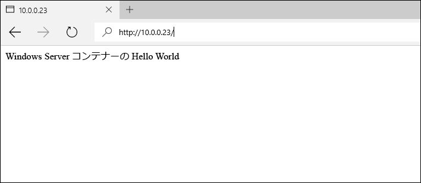
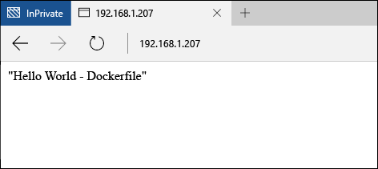

# Windows Server のコンテナー イメージ

**この記事は暫定的な内容であり、変更される可能性があります。** 

前の Windows Server クイック スタートでは、Windows コンテナーが既存のコンテナー イメージから作成されました。 この演習では、独自のコンテナー イメージを手動で作成する方法と Dockerfile でイメージを作成する方法を詳しく説明します。

このクイック スタートは Windows Server 2016 の Windows Server コンテナーのみに適用されます。 このページの左側の目次に追加のクイック スタート文書があります。 

**前提条件:**

- [Windows Server 2016 Technical Preview 5](https://www.microsoft.com/en-us/evalcenter/evaluate-windows-server-technical-preview) を実行している 1 台のコンピューター システム (物理または仮想)。
- Windows コンテナー機能と Docker でこのシステムを構成します。 これらの手順のチュートリアルについては、「[Windows Containers on Windows Server](./quick_start_windows_server.md)」 (Windows Server の Windows コンテナー) を参照してください。

## 1.コンテナー イメージ - 手動

この演習は Windows コマンド シェル (cmd.exe) から実行すると、最も効果的です。

コンテナー イメージを手動で作成するための最初の手順はコンテナーを展開することです。 この例では、事前に作成した IIS イメージから IIS イメージを展開します。 コンテナーが展開されたら、コンテナー内からシェル セッションで操作します。 対話型セッションが `-it` フラグで開始されます。 Docker Run コマンドの詳細については、Docker.com の「[Docker Run Reference]( https://docs.docker.com/engine/reference/run/)」を参照してください。 

```none
docker run -it -p 80:80 microsoft/iis:windowsservercore cmd
```

次に、コンテナーが変更されます。 次のコマンドを実行して、IIS スプラッシュ画面を削除します。

```none
del C:\inetpub\wwwroot\iisstart.htm
```

次のコマンドを実行して、既定の IIS サイトを新しい静的サイトに置き換えます。

```none
echo "Hello World From a Windows Server Container" > C:\inetpub\wwwroot\index.html
```

別のシステムから、コンテナー ホストの IP アドレスを参照します。 ‘Hello World’ アプリケーションが表示されるはずです。

**注:** Azure で作業している場合、ポート 80 経由のトラフィックを許可するために、ネットワーク セキュリティ グループ ルールを設定する必要があります。 詳細については、「[既存の NSG に規則を作成する]( https://azure.microsoft.com/en-us/documentation/articles/virtual-networks-create-nsg-arm-pportal/#create-rules-in-an-existing-nsg)」をご覧ください。



コンテナーに戻り、対話型のコンテナー セッションを終了します。

```none
exit
```

これで、変更されたコンテナーを新しいコンテナー イメージにキャプチャできます。 それには、コンテナー名が必要になります。 これを見つけるには、`docker ps -a` コマンドを使用します。

```none
docker ps -a

CONTAINER ID     IMAGE                             COMMAND   CREATED             STATUS   PORTS   NAMES
489b0b447949     microsoft/iis:windowsservercore   "cmd"     About an hour ago   Exited           pedantic_lichterman
```

新しいコンテナー イメージを作成するには、`docker commit` コマンドを使用します。 Docker コミットの形式は “docker commit container-name new-image-name” になります。 注記 – この例のコンテナー名を実際のコンテナー名に置き換えます。

```none
docker commit pedantic_lichterman modified-iis
```

新しいイメージが作成されたことを確認するには、`docker images` コマンドを使用します。  

```none
docker images

REPOSITORY          TAG                 IMAGE ID            CREATED              SIZE
modified-iis        latest              3e4fdb6ed3bc        About a minute ago   10.17 GB
microsoft/iis       windowsservercore   c26f4ceb81db        2 weeks ago          9.48 GB
windowsservercore   10.0.14300.1000     dbfee88ee9fd        8 weeks ago          9.344 GB
windowsservercore   latest              dbfee88ee9fd        8 weeks ago          9.344 GB
```

これで、このイメージを展開できます。 結果的に生成されるコンテナーには、キャプチャされたすべての変更が含まれます。

## 2.コンテナー イメージ - Dockerfile

前回の演習によって、コンテナーが手動で作成され、変更されて、新しいコンテナー イメージにキャプチャされています。 Docker には、このプロセスを自動化するためのメソッドが含まれており、Dockerfile と呼ばれるものを使用します。 この演習の結果は前回とほぼ同じになりますが、今回はプロセスが自動化されます。

コンテナー ホストで、ディレクトリ `c:\build` を作成し、このディレクトリ内に `Dockerfile` という名前のファイルを作成します。 注記 – このファイルにはファイル拡張子を与えません。

```none
powershell new-item c:\build\Dockerfile -Force
```

Dockerfile をメモ帳で開きます。

```none
notepad c:\build\Dockerfile
```

Dockerfile に次のテキストをコピーし、ファイルを保存します。 これらのコマンドは、`microsoft/iis` を基礎として使用し、新しいイメージを作成するように Docker に指示します。 dockerfile は次に、`RUN` の指示に指定されているコマンドを実行します。この場合、index.html ファイルが新しいコンテンツで更新されます。 

Dockerfile の詳細については、「[Dockerfiles on Windows](../docker/manage_windows_dockerfile.md)」 (Windows 上の Dockerfile) を参照してください。

```none
FROM microsoft/iis:windowsservercore
RUN echo "Hello World - Dockerfile" > c:\inetpub\wwwroot\index.html
```

`docker build` コマンドはイメージ ビルド プロセスを開始します。 `-t` パラメーターは、新しいイメージに `iis-dockerfile` という名前を付けるようにビルド プロセスに指示します。

```none
docker build -t iis-dockerfile c:\Build
```

完了したら、`docker images` コマンドを使用して、イメージが作成されたことを確認できます。

```none
docker images

REPOSITORY          TAG                 IMAGE ID            CREATED             SIZE
iis-dockerfile      latest              8d1ab4e7e48e        2 seconds ago       9.483 GB
microsoft/iis       windowsservercore   c26f4ceb81db        2 weeks ago         9.48 GB
windowsservercore   10.0.14300.1000     dbfee88ee9fd        8 weeks ago         9.344 GB
windowsservercore   latest              dbfee88ee9fd        8 weeks ago         9.344 GB
```

次のコマンドでコンテナーを展開します。 

```none
docker run -d -p 80:80 iis-dockerfile ping -t localhost
```

コンテナーが作成されたら、コンテナー ホストの IP アドレスを参照します。 hello world アプリケーションが表示されるはずです。



コンテナー ホストに戻り、`docker ps` を使用してコンテナーの名前を取得し、`docker rm` を使用してコンテナーを削除します。 注記 – この例のコンテナー名を実際のコンテナー名に置き換えます。

コンテナー名を取得します。

```none
docker ps

CONTAINER ID   IMAGE            COMMAND               CREATED              STATUS              PORTS                NAMES
c1dc6c1387b9   iis-dockerfile   "ping -t localhost"   About a minute ago   Up About a minute   0.0.0.0:80->80/tcp   cranky_brown
```

コンテナーを削除します。

```none
docker rm -f cranky_brown
```

## 次の手順

[Windows 10 の Windows コンテナー](./quick_start_windows_10.md)

<!--HONumber=Jun16_HO2-->


