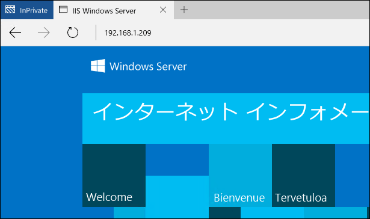

# Windows Server の Windows コンテナー

**この記事は暫定的な内容であり、変更される可能性があります。**

この演習では、Windows Server の Windows コンテナー機能の基本的な展開と使用について段階的に確認します。 完了後、コンテナー ロールがインストールされ、シンプルな Windows Server コンテナーが展開されます。 このクイック スタートを始める前に、コンテナーの基本的な概念と用語を理解しておいてください。 情報は[クイック スタートの概要](./quick_start.md)にあります。

このクイック スタートは Windows Server 2016 の Windows Server コンテナーのみに適用されます。 このページの左側の目次に追加のクイック スタート文書があります。

**前提条件:**

[Windows Server 2016 Technical Preview 5](https://www.microsoft.com/en-us/evalcenter/evaluate-windows-server-technical-preview) を実行している 1 台のコンピューター システム (物理または仮想)。

完全に構成された Windows Server イメージは Azure で利用できます。 このイメージを利用するには、下のボタンをクリックして仮想マシンをデプロイします。 デプロイには 10 分ほどかかります。 完了したら、Azure 仮想マシンにログインし、このチュートリアルの手順 4 に進みます。 

<a href="https://portal.azure.com/#create/Microsoft.Template/uri/https%3A%2F%2Fraw.githubusercontent.com%2FMicrosoft%2FVirtualization-Documentation%2Fmaster%2Fwindows-server-container-tools%2Fcontainers-azure-template%2Fazuredeploy.json" target="_blank">
    
</a>

## 1.コンテナー機能のインストール

コンテナー機能は、Windows コンテナーを使用する前に有効にする必要があります。 そのためには、管理者特権の PowerShell セッションで次のコマンドを実行します。

```none
Install-WindowsFeature containers
```

機能のインストールが完了したら、コンピューターを再起動します。

```none
Restart-Computer -Force
```

## 2.Docker のインストール

Docker は Windows コンテナーで使用するために必要です。 Docker は、Docker エンジンと Docker クライアントで構成されます。 この演習では、両方をインストールします。

Docker エンジンとクライアントを 1 つの zip アーカイブとしてダウンロードします。

```none
Invoke-WebRequest "https://get.docker.com/builds/Windows/x86_64/docker-1.12.0.zip" -OutFile "$env:TEMP\docker-1.12.0.zip" -UseBasicParsing
```

zip アーカイブをプログラム ファイルに展開します。

```none
Expand-Archive -Path "$env:TEMP\docker-1.12.0.zip" -DestinationPath $env:ProgramFiles
```

Docker ディレクトリをシステム パスに追加します。

```none
# for quick use, does not require shell to be restarted
$env:path += ";c:\program files\docker"

# for persistent use, will apply even after a reboot 
[Environment]::SetEnvironmentVariable("Path", $env:Path + ";C:\Program Files\Docker", [EnvironmentVariableTarget]::Machine)
```

Windows サービスとして Docker をインストールするには、以下を実行します。

```none
dockerd --register-service
```

インストールされたら、サービスを開始することができます。

```none
Start-Service docker
```

## 3.コンテナーの基本イメージのインストール

Windows コンテナーは、テンプレートまたはイメージから展開されます。 コンテナーを展開する前に、基本 OS イメージをダウンロードする必要があります。 次のコマンドを実行すると、Windows Server Core 基本イメージがダウンロードされます。

```none
docker pull microsoft/windowsservercore
```

このプロセスには多少時間がかかるため、ここで休憩しましょう。ダウンロードが完了したら再開します。

イメージの pull が完了したら、`docker images` を実行するとインストール済みのイメージのリストが返されます。この場合は Windows Server Core のイメージです。

```none
docker images

REPOSITORY                    TAG                 IMAGE ID            CREATED             SIZE
microsoft/windowsservercore   latest              02cb7f65d61b        8 weeks ago         7.764 GB
```

Windows コンテナー イメージの詳細については、[コンテナー イメージの管理](../management/manage_images.md)に関するページを参照してください。

## 4.最初のコンテナーの展開

この演習では、事前作成された IIS イメージを Docker Hub レジストリからダウンロードし、IIS を実行するシンプルなコンテナーを展開します。  

Windows コンテナー イメージの Docker Hub を検索するには、`docker search Microsoft` を実行します。  

```none
docker search microsoft

NAME                                         DESCRIPTION
microsoft/aspnet                             ASP.NET is an open source server-side Web ...
microsoft/dotnet                             Official images for working with .NET Core...
mono                                         Mono is an open source implementation of M...
microsoft/azure-cli                          Docker image for Microsoft Azure Command L...
microsoft/iis                                Internet Information Services (IIS) instal...
microsoft/mssql-server-2014-express-windows  Microsoft SQL Server 2014 Express installe...
microsoft/nanoserver                         Nano Server base OS image for Windows cont...
microsoft/windowsservercore                  Windows Server Core base OS image for Wind...
microsoft/oms                                Monitor your containers using the Operatio...
microsoft/dotnet-preview                     Preview bits for microsoft/dotnet image
microsoft/dotnet35
microsoft/applicationinsights                Application Insights for Docker helps you ...
microsoft/sample-redis                       Redis installed in Windows Server Core and...
microsoft/sample-node                        Node installed in a Nano Server based cont...
microsoft/sample-nginx                       Nginx installed in Windows Server Core and...
microsoft/sample-httpd                       Apache httpd installed in Windows Server C...
microsoft/sample-dotnet                      .NET Core running in a Nano Server container
microsoft/sqlite                             SQLite installed in a Windows Server Core ...
...
```

`docker pull` を利用し、IIS イメージをダウンロードします。  

```none
docker pull microsoft/iis
```

イメージ ダウンロードは `docker images` コマンドで確認できます。 ここでは、ベース イメージ (windowsservercore) と IIS イメージの両方が表示されることに注意してください。

```none
docker images

REPOSITORY                    TAG                 IMAGE ID            CREATED             SIZE
microsoft/iis                 latest              accd044753c1        11 days ago         7.907 GB
microsoft/windowsservercore   latest              02cb7f65d61b        8 weeks ago         7.764 GB
```

`docker run` を使用し、IIS コンテナーを展開します。

```none
docker run -d -p 80:80 microsoft/iis ping -t localhost
```

このコマンドは IIS イメージをバックグラウンド サービス (-d) として実行し、コンテナー ホストのポート 80 がコンテナーのポート 80 にマッピングされるようにネットワーキングを構成します。
Docker Run コマンドの詳細については、Docker.com の「[Docker Run リファレンス]( https://docs.docker.com/engine/reference/run/)」をご覧ください。


実行中のコンテナーは `docker ps` コマンドで確認できます。 コンテナーの名前をメモしてください。後の手順で使用されます。

```none
docker ps

CONTAINER ID  IMAGE          COMMAND              CREATED             STATUS             PORTS               NAME
09c9cc6e4f83  microsoft/iis  "ping -t localhost"  About a minute ago  Up About a minute  0.0.0.0:80->80/tcp  big_jang
```

別のコンピューターから、Web ブラウザーを開き、コンテナー ホストの IP アドレスを入力してください。 すべてが正しく構成されていれば、IIS のスプラッシュ画面が表示されます。 これは、Windows コンテナーでホストされている IIS インスタンスからサービスが提供されている状態です。

**注:** Azure を使用している場合、仮想マシンの外部 IP アドレスと、構成されているネットワーク セキュリティが必要になります。 詳細については、「[既存の NSG に規則を作成する]( https://azure.microsoft.com/en-us/documentation/articles/virtual-networks-create-nsg-arm-pportal/#create-rules-in-an-existing-nsg)」をご覧ください。



コンテナー ホストに戻り、`docker rm` コマンドを使用してコンテナーを削除します。 注記 – この例のコンテナー名を実際のコンテナー名に置き換えます。

```none
docker rm -f big_jang
```
## 次の手順

[Windows Server のコンテナー イメージ](./quick_start_images.md)

[Windows 10 の Windows コンテナー](./quick_start_windows_10.md)


<!--HONumber=Aug16_HO4-->


